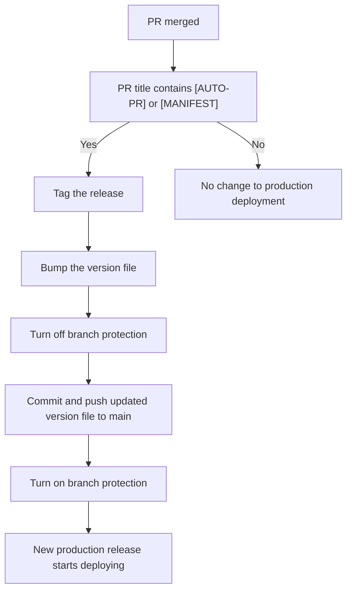

# Production release automation

Date: 2022-03-09

## Status

**Approved**

## Context

Production deployments of the Notify product suite  [`notification-api`, `notification-admin`, `notification-document-download-api`, `notification-document-download-frontend`, `notification-documentation`] are centrally managed through the [manifest repository](https://github.com/cds-snc/notification-manifests).

The release process has been automated through the use of the CDS developed [Notify PR bot](https://github.com/cds-snc/notification-pr-bot). 

This bot will monitor for new changes to any of the products by tracking merged pull requests (PR) and will automatically prepare a new release candidate by creating a pull request against the [manifest repository](https://github.com/cds-snc/notification-manifests). All PRs created by the Notify PR bot contain the prefix `[AUTO-PR]`.

Upon approving and merging this release candidate, a new release would get deployed to production containing all new changes from the monitored repositories.

The [manifest repository](https://github.com/cds-snc/notification-manifests) is also used to manage configuration options of the Notify Kubernetes (K8s) cluster running in Amazon EKS. These changes are managed seperately from the Notify PR bot process.

### Why?

There was a misunderstanding relating to how the K8s kustimzation file was being updated, that led to the accidental deployment of changes immediately to production. This was caused by a portion of the configuration referencing a git commit and the remainder referencing files locally.

Once this was discovered, the [manifest repository](https://github.com/cds-snc/notification-manifests) release strategy was modified to use a `VERSION` file containing a tagged release where the existing github workflows would now use as the base for building a new release.

This change has resulted in the introduction of additional manual steps to release Notify products to production. Primarily, tagging a release after merging the release candidate created by the [Notify PR bot](https://github.com/cds-snc/notification-pr-bot), and then creating a new PR to update the `VERSION` file to contain a reference to that tagged release.

This document proposes a solution that will restore the ability to release to production by approving and merging a PR without any additional manual intervention.

## Proposed solution

A GitHub Actions workflow that will launch when a pull request containing `[AUTO-PR]` and *new:*`[MANIFEST]` is merged.

Once launched, this new workflow will:
- Tag a new release
- Update the `VERSION` file to contain the new release version
- Temporaily disable branch protection
- Commit the updated version file to the main branch
- Re-enable branch protection

The commit will then automatically trigger a new release.

This new workflow will also use the Notify PR bot access token, so that all automated actions have the ability to trigger additional workflows, as well as attributing file changes and workflow triggers to the Notify PR bot.

## Additional considerations

- GitHub workflows are prevented from triggering other workflows in-order to protect against recursive actions. All actions that require triggering other workflows must be performed using a Personal Access Token (PAT) or access token of a GitHub Bot.
- In-order to commit directly to the main branch, branch protection must be disabled and cannot be overriden by admins. This disable/enable of branch protection is a crucial item that allow the workflow to "bump" the `VERSION` file
