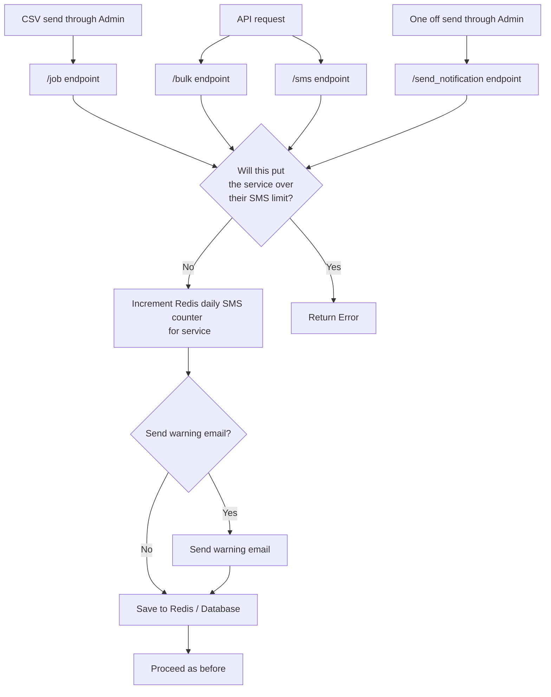

# SMS Limits

Date: 2022-11-04

## Status

**DRAFT**

## Context

Prior to changes brought in at the time of writing this ADR, Notify only had a "combined" email and SMS limit. As we need better individual control of each notification types, we implemented a limit to control the SMS limits associated with each service.

Note that the original limit still act as a global one for emails and SMS, i.e. a global limit of 10,000 and SMS limit of 1,000 on SMS for a service would allow the service to both send during a day 10,000 emails but 0 SMS or 9,000 emails and 1,000 SMS. We want to refine the global limit in the future to be exclusive to emails.

These proposed changes were prompted by an incident where we had a very high and unexpected volume of SMS sends. The service who triggered this incident was sending as much as 4 fragments per SMS notifications which led to unexpected volume getting way past the limits set in the service configuration. This led to slower processing of SMS in the defined priority lane as well as many more SMS messages were populating it.

## Implementation overview

In order to enforce a new SMS-specific limit, we have added checks to the "front door" of the API, where the post requests come in that result in an SMS send:
- for the `/<uuid:service_id>/send-notification` endpoint used by the Admin "send one off" flow: [app/service/send_notification.py](https://github.com/cds-snc/notification-api/blob/d3412ad3697162550d3f5d73958f488a305d3cf7/app/service/send_notification.py#L66)
- for the job creation endpoint used by the Admin CSV send flow: [app/job/rest.py](https://github.com/cds-snc/notification-api/blob/d3412ad3697162550d3f5d73958f488a305d3cf7/app/job/rest.py#L149)
- for the `/bulk` API endpoint defined in [app/v2/notifications/post_notifications.py](https://github.com/cds-snc/notification-api/blob/d3412ad3697162550d3f5d73958f488a305d3cf7/app/v2/notifications/post_notifications.py#L186)
- for the `/sms` API endpoint defined in [app/v2/notifications/post_notifications.py](https://github.com/cds-snc/notification-api/blob/d3412ad3697162550d3f5d73958f488a305d3cf7/app/v2/notifications/post_notifications.py#L228)

Before arriving at this solution, we tried adding checks to other places in the API code (ie celery), including where the notifications are created in the database and where they are sent to SES. These other locations proved prone to errors and difficult to test, which led us to move all related code to the "front door".

Placing the limits later in the data pipeline is alluring if we want a precise limit to be honored by the system and a single point to apply the logic. The inconvenience though is that as the data pipeline might process notifications in minutes, the API front door still continue to process intake messages. There is a time window when the system accepted more messages than the limits should have accepted, as it is at the sending stage. This has the side effect of having idle notifications caught in the system. This presents additional challenges of what to do with these notifications. Do we wait for the next day when the limit will lower again or should we mark these notifications as failures, unbeknownst to the sender unless they continually check the status of the notification? 

Considering this might be a bad user experience, which could also lead to additional design challenge, moving the logic to the front door to inform the user as early as we can seemed the best option.

## SMS limit logic flowchart

## API implementation notes

There are six main back end pieces:
- A column in the Services table indicating the SMS fragment daily limit for that service.
- A counter in redis which tracks how many fragments have been sent that day.
- Code to increment the counter appropriately.
- Code to compare the counter to the service's daily limit.
- New SMS Limits specific emails
- Code to send the emails to the service owners when they reach 80% or 100% of their daily limit.

## Admin implementation notes

For V1 we made the minimal set of changes:
- An error message that is displayed in the CSV send flow.
- An error message that is diplayed in the "one off" and "send to myself" send flows.
- A new entry on the settings page that is visible to users "Daily text fragments limit".
- A corresponding new entry in the platform admin settings to allow this limit to be changed.

See [Figma](https://www.figma.com/file/j7NLJsOY8UQkGNH50Js00t/Sending-capacity---capacit%C3%A9-d'envoi?node-id=1%3A8) for more details.

## Current status

We have implemented V1 as described above.

## Future Work

### Scheduled sends

We need to correctly enforce SMS limits on sends scheduled for a future day. Currently, we add these scheduled SMS to the current day's Redis counter. To implement this correctly, we should create a new Redis counter for the future day, and add these scheduled SMS to that redis counter. We will also need to be more careful about when we expire this value in Redis, so that it is not expired prematurely.

### V2 Release

UI changes to better surface the SMS Limit to users, after usability testing occurs.

## Decision

- We will implement V1 / V2 and the scheduling changes as described.

## Consequences

- We have better control over the amount of SMS being sent.
- Service owners could be confused over the new restrictions.
