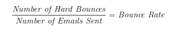

# Bounce rate automated emergency brake
Date: 2023-01-26

## Status
**DRAFT**.
_VALUES: (DRAFT, IN REVIEW, APPROVED, REJECTED)_

## Context

### What is the bounce rate
The bounce rate is a metric monitored by AWS for each user of their Simple Email Service (SES) platform. A bounce occurs when an email is rejected by a recipient's mail system and may not be delivered.

### Why the bounce rate is important
A high bounce rate often indicates large amounts of unsolicited email are being sent and email providers take this into account when deciding whether to deliver email.  A high bounce rate can cause emails to be sent to users' spam folders and AWS could suspend our email sending capability if our bounce rate exceeds a certain threshold.

### Hard and soft bounces
A hard bounce occurs when an email is sent but cannot be delivered due to a persistent issue such as an invalid email address. These emails will not be retried.

A soft bounce occurs due to a temporary failure, such as a mailbox being full, a mailbox being temporarily unavailable or a mail server being overloaded. These bounces do not initially count towards the bounce rate.  SES will automatically retry for a period of time, after which the email may be marked as a hard bounce.

### Bounce types and sub-types
AWS defines bounces as the following:
 Bounce type   | Bounce sub type          |
|--------------|--------------------------|
| Undetermined | Undetermined             |
| Hard         | General                  |
| Hard         | NoEmail                  |
| Hard         | Suppressed               |
| Hard         | OnAccountSuppressionList |
| Soft         | General                  |
| Soft         | MailboxFull              |
| Soft         | MessageTooLarge          |
| Soft         | ContentRejected          |
| Soft         | AttachmentRejected       |

### Synchronous and Asynchronous Bounces
Both synchronous and asynchronous bounces occur after the email has been sent to SES and is communicated via a callback to Notify.
### Bounce rate calculation
AWS calculates the bounce rate as the number of hard bounces per the total number of sent emails, expressed as a percentage:



### AWS bounce rate thresholds

| Bounce rate                      | AWS determination    |
|----------------------------------|----------------------|
| Below 5%                         | Healthy              |
| >=5% and <10%                    | Under review         |
| >=10%                            | At risk              |

### How GC Notify's bounce rate is measured by AWS
All services using the GC Notify platform are seen in aggregate by AWS. The GC Notify platform as a whole has a single bounce rate. Individual services contribute to the bounce rate, with higher-volume services having a larger impact than lower-volume services.

## Why this feature is needed
The purpose of this feature is to keep the bounce rate as low as possible across GC Notify. This will give the platform a positive sending reputation which will ensure emails are consistently trusted and delivered by email providers.  This can be done by monitoring each service's bounce rate and automatically warning service owners and suspending services when they reach certain thresholds.  It will also be necessary to provide users with guidance to explain these concepts and help to them keep their bounce rate low.

# Proposed solution
## Features
### Track email notification bounce type
Record the bounce type of every email notification sent, including synchronous and asynchronous bounces.

### Notify a service when its bounce rate is at `[bounce-rate-warning-percentage]`
When a service's bounce rate reaches `[bounce-rate-warning-percentage]`, notify the service owner so they can take action to reduce their bounce rate.  The message should contain a link to the service's dashboard where they can see their bounce rate and take action to reduce it.

### Minimum volume threshold for warning a service
Low-volume senders won't have a large impact on the bounce rate, and notifying them directly may lead to many support calls. In order to limit this, only notify services that are sending more than `[bounce-rate-warning-notification-volume-minimum]` emails in the `[bounce-rate-window]`.  This minimum could either be a fixed number or a percentage of the total number of emails sent by all services.

### Suspend a service when it reaches the `[bounce-rate-critical-percentage]`
When a service's bounce rate reaches the `[bounce-rate-critical-percentage]`, suspend their service to prevent them from sending any more emails. Notify the GC Notify admins as well as the service owner that their service has been suspended and provide them with a link to the service's dashboard where they can see their bounce rate and take action to reduce it.

### Un-suspending a service
When a service is suspended, a process will be needed to follow to get them operational again.  This could look like:
- Communicating with users through support to tell them what the issue is and provide a fix on their end first
- Looking at the GC Notify AWS account bounce rate and determining if the platform is in a danger zone
- Once users have fixed their distribution list, reviewing their fix and wait for Notify bounce rate to go down if in a dangerous zone to reactivate the service
- Monitoring the service and their bounce rate in the following days to check that their fix was effective

####  Add bounce rate information to the service dashboard
Add a service's bounce rate to the service dashboard so that service owners can see their bounce rate and proactively keep their bounce rate from rising in the first place.

### Minimum volume threshold for bounce rate display
Bounce rates should only be displayed once a service sends a minimum number of emails in the `[bounce-rate-window]`. The value `[bounce-rate-display-volume-minimum]` will be used to prevent displaying bounce rate warnings or errors when a service has only sent a small number of emails.

###  Provide bounce rate guidance
Provide guidance to service owners to explain bounce rate concepts and how they apply to their service.  Provide guidance on how services can keep their bounce rate low.

###  Bounce rate calculation for a service
The formula for calculating a service's bounce rate will be the total number of hard bounces the service received divided by the total number of emails the service sent during the `[bounce-rate-window]`.

## Technical considerations
### Changes to the Notification model
In order to store the bounce rate GC Notify needs to record a few pieces of information for each notification:
- The bounce type
- The bounce sub-type
- The ses_feedback_id associated with the bounce
- The date and time the bounce occurred

This will require 4 new columns in the notifications table to store the bounce type.

### Calculating the bounce rate
We will store the bounce rate data for a service in Redis, which will be the source of truth for calculating and checking a services bounce rate.

### Changes to the dashboard
A new section will be added to the dashboard to present a service's bounce rate to the owner of the service. We will use the data stored in Redis to calculate and display a services bounce rate for a given `[bounce-rate-window]`.

### Monitoring bounce rates
Bounce rates can be monitored by AWS log metrics in combination with alarms that will notify us via the `#notification-ops` channel in Slack when a service exceeds `[bounce-rate-warning-percentage]` or `[bounce-rate-critical-percentage]`.

In addition to metrics and alarms, bounce rates can be monitored by a periodic celery task that polls Redis for bounce data, and notifies services that are over `[bounce-rate-warning-percentage]` and suspends services that are over `[bounce-rate-critical-percentage]`.

This task should be many times a day (at least once every 5 minutes) to ensure that services are notified and suspended as soon as possible after they reach one of these limits.

# Implementation details
## Leveraging redis to store bounce rate
In order to reduce database calls as part of this feature, we can leverage Redis to store service bounce rates.  We will need to store two pieces of information to track the bounce rate: total emails sent and number of hard bounces during the `[bounce-rate-window]`.  When the redis cache for a service has not been created, a query to get these values could look something like this:
```sql
with data as
(

select
    service_id,
    count(id) as total_emails,
    count(*) FILTER (WHERE notification_status ='permanent-failure' ) AS hard_bounces
from
    notifications
where
    created_at BETWEEN NOW() - INTERVAL '24 HOURS' AND NOW() -- this value is the `[bounce-rate-window]`
group by
    service_id
having
    count(id) >= 1000 -- this value is the `[bounce-rate-warning-notification-volume-minimum]`
)

select *, 100*(hard_bounces::decimal/total_emails::decimal) as bounce_rate from data
```

### Storing total emails sent
Keeping track of emails sent per service during the `[bounce-rate-window]` should be done centrally to avoid code duplication.  This can be stored in Redis as part of the `deliver_email` celery task.

### Storing the number of hard bounces
Hard bounces can be detected as part of the `process-ses-result` celery task, and can be stored in redis for the `[bounce-rate-window]`.

# Redis Implementation Details
## Keys in Redis

In order to not hit the database directly we are going to store two keys for each service. These two keys are stored as a Redis sorted set. The `{key:value}` pair input will be `{notification_id: epoch}`

`sliding_total_notifications:{service_id}`\
`sliding_hard_bounce:{service_id}`

$$\text{Bounce Rate} = \frac{\text{length}( \text{hard bounces:\{service id\}} )}{ \text{length}( \text{total notifications:\{service id\}} )}$$


As the `key` must be unique we used `notification_id`. We add to total_notifications every single time we send a notification. With the `value` as `epoch` so we might calculate the bounce rate using a sliding window. We can find the length of the above two keys, where only the keys in the last 24 hours (this is adjustable) are included in the calculation.

## Seeding Redis

### Seeding the keys:
When we seed `sliding_total_notifications:{service_id}` or `sliding_hard_bounce:{service_id}` per service_id, we would have to take every single notification sent in the last X-hours (X being 24 etc) and add to the `sliding_notifications:{service_id}` key. This would mean looping through every single notification row for the last 24 hours and adding it to the list.

Instead, for each `service_id`, we will find the `total notifications` and `total hard bounces` per hour in the last 24 hours. We use the same pattern as before with a slight deviation, where instead of the `notification_id` we generate a new uuid: `{uuid: epoch}`. Since the key is of little value outside of being a unique identifier in Redis, then we can speed up the seeding process by omitting collection of the `notification_id` in our queries.

To ensure that Celery workers do not concurrently seed the same service's bounce rate data we add `seeding_started_key` for each service. When the Celery task to seed a service starts, this key is checked to determine whether to proceed with the seeding process.

Each service, then, will have the following keys:\
`sliding_total_notifications:{service_id}`\
`sliding_hard_bounce:{service_id}`\
`seeding_started:{service_id}`

The keys will expire within the chosen sliding window. Currently this window is defined as a 24 hour period.

The new bouce rate calculation for a service will be:

$$Bounce Rate = \frac {
    \sum\limits_{n=1}^{24} \text{hard bounces seeded n}  +
    \text{length} ( \text{sliding hard bounce} )
}{
    \sum\limits_{n=1}^{24}  \text{notifications seeded n}  +
    \text{length} ( \text{sliding notifications} )
}$$


This above bounce rate is not an exact number but it an approximation of what the bounce rate is likely to be within a sliding window.

## Keys Task

If we wanted to see all the keys for ALL the services - we should make an AWS ECS task that we can kick off.\
Instead as an optimization, we should only seed the keys for a service where:
1. A user from the service has logged into the ADMIN
1. We get a message from the API for a certain service

In both the above scenarios we will kick off a celery task that will see the bounce rate data. We need to ensure that if users of the service login, or we send multiple jobs through the API - we are not constantly starting the celery task to seed the bounce rate.

## Redis Memory Consideration

We are currently using 500mb on our Redis cluster which is assigned 1G of RAM. An increase in the number of keys means we might need to upgrade the cluster. [Current memory usage estimations and analysis](https://github.com/cds-snc/notification-attic/pull/31) and recent [Redis memory usage](https://gcdigital.slack.com/archives/CV38DBNVA/p1685372981086749) shows that, for the time being, this is not something we need to consider right now, but as Notify grows we will need to keep this in mind.

# Additional considerations

## Staggered roll-out
To prevent suspending services that may not actually be causing issues with the overall bounce rate, it is suggested to roll out this feature in stages.

### Version 1
The first stage would include tracking bounces, calculating bounce rates, and displaying them on service dashboards. It would also include providing bounce rate guidance for services.

### Version 1.5
The second stages would include bug fixes, and any adjustments to the way we calculate bounce rate.

### Version 2
Once the calculations have been confirmed to work satisfactorily with live data, the third stage can be rolled out which will include warning and suspending services.

# How GC Notify handles bounce notifications from SES
GC Notify uses a lambda function named `ses-to-sqs-email-callbacks` to handle bounce notifications sent back from SES.  When a callback comes in, the lambda function parses the bounce notification and sends it a queue to be picked up and run by the celery task `process-ses-result`.  The `process-ses-result` task updates the status of the notification in the database including whether it was a hard or a soft bounce.

## Proposed values

The values below can be used as a starting point for this feature.  They should be reviewed and adjusted as needed as the feature is tested and rolled out.

| Parameter                                       | Value    | Notes                                                                                                                        |
|-------------------------------------------------|----------|------------------------------------------------------------------------------------------------------------------------------|
| bounce-rate-warning-percentage                  |       5% | AWS indicates a 5% bounce rate as under review, so we should warn no higher than this                                        |
| bounce-rate-critical-percentage                 |      10% | AWS indicates a 10% or higher bounce rate as at risk, so we should suspend before this                                       |
| bounce-rate-window                              | 24 hours | This should be at a minimum 24 hours, but could be a longer period                                                           |
| bounce-rate-warning-notification-volume-minimum |     1000 | This should be a significantly high number to ensure we only notify users with enough volume to sway the overall bounce rate |
| bounce-rate-display-volume-minimum              |     1000 | This value should be no less than 1000, to ensure the displayed bounce rate is meaningful                                    |


## Consequences

_TODO: Describe foreseen and felt consequences of the decision (possible after 1-3 months)._

## References
- _Bounce and complaint rates_: https://docs.aws.amazon.com/pinpoint/latest/userguide/channels-email-deliverability-dashboard-bounce-complaint.html
- _Email Definitions: Bounces_: https://aws.amazon.com/blogs/messaging-and-targeting/email-definitions-bounces/

