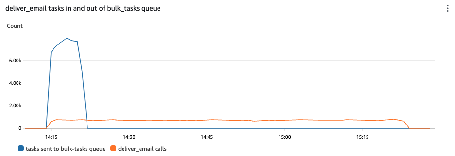
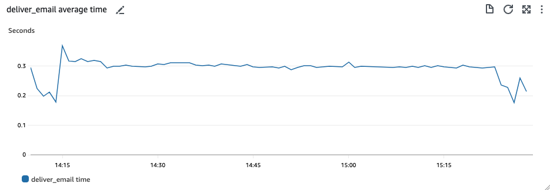
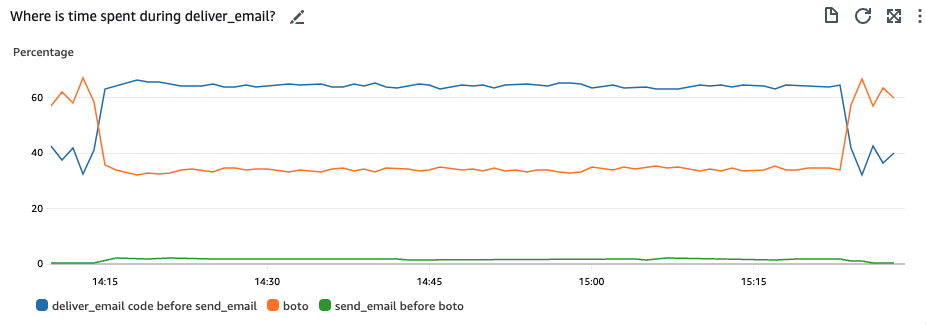
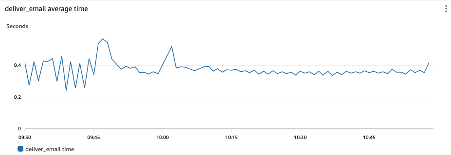
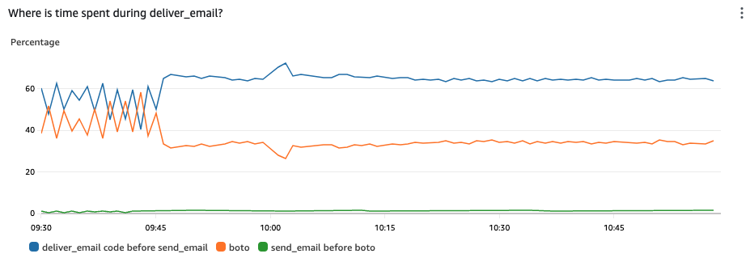

# Scalability: increasing send rates

Date: 2023-06-27

## Status

**APPROVED**.

## Context

Because GCNotify usage grows, we need to increase our email and SMS send rates. We have observed usage doubling every 8 to 10 months aproximately. This is especially a concern as we are opening up usage to provinces in the upcoming months.

## Measuring our current limits

Let's assess the rates under which GCNotify system operates in, including the AWS sets upon it.

### Email

Currently in staging and production our email rate limit with SES is [100 emails per second and the total sending capacity is 200K per day](https://ca-central-1.console.aws.amazon.com/ses/home?region=ca-central-1#/account). These limits can be raised on request to AWS support.

### SMS

Currently we are using [long codes in PinPoint](https://ca-central-1.console.aws.amazon.com/pinpoint/home?region=ca-central-1#/sms-account-settings/phoneNumbers) to send SMS. Each long code can send one SMS fragment / second. On staging we have one long code and on production we have 20. So our AWS limits are 1 fragment / second on staging and 20 fragments / second on production. We can request more long codes, though we need to provide explanation to our provider in order to increase these with numbers to back this up. Note that the limit for each short code is 100 fragments / second, so switching to short codes would substantially increase our AWS SMS send limit.

## Measurements

### Emails pipeline

Emails are batch saved into the database. This does not appear to be a bottleneck. Each email is send by its own `deliver_email` task.

[`deliver_email()`](https://github.com/cds-snc/notification-api/blob/main/app/celery/provider_tasks.py#L63)
- Fetches the notification using the id
- Calls `send_email_to_provider()`
- So basically a wrapper for send_email_to_provider()

[`send_email_to_provider()`](https://github.com/cds-snc/notification-api/blob/main/app/delivery/send_to_providers.py#L191)
- Prepares the email
- Get the template
- Fill it out
- Get any files if they’re attached
- Calls `send_email()` with the html and any attachments

[`send_email()`](https://github.com/cds-snc/notification-api/blob/main/app/clients/email/aws_ses.py#L33)
- Creates a MIME email with the html and attachments
- Calls boto3 client function `send_raw_email()` with the MIME email

So there are basically 3 areas that can take time
- `send_email_to_provider()` code before the `send_email()` call
- `send_email()` code before the `send_raw_email()` call
- the `send_raw_email()` call

### Bottleneck discovery

We have timing metrics for

- `deliver_email()` (which should be the same as `send_email_to_provider()`): celery_tasks_deliver_email
- `send_email()`: celery_clients_ses_send_email
- `send_raw_email()`:  celery_clients_ses_request-time

We uploaded a csv of 50K emails (with one variable and no file attachments) to the **staging environment** (send to `success@simulator.amazonses.com`) on July 12, 2:15 pm EST and monitored the [scaling dashboard](https://ca-central-1.console.aws.amazon.com/cloudwatch/home?region=ca-central-1#dashboards/dashboard/ScalingTemp?start=2023-07-12T18%3A10%3A00Z&end=2023-07-12T19%3A30%3A00Z&autoRefresh=false).

This graph shows that messages to `deliver_email` tasks, backed by the `bulk-tasks` queue, are added with a rate of ~7500 per minute. The processing rate of the task itself though is of about ~750 per minute, meaning we send to this rate. **This indicates the bottleneck is not upstream, when the task comes in, but at the final stage of sending delivery**.

This graph shows that each deliver_email task took approximately 0.3 seconds during the load test.

From this graph we see that during the deliver_email task:
- 65% of the time is in `deliver_email()` code before calling `send_email()`
- 2% of the time is spent in `send_email()` code before calling `send_raw_email()`
- 33% of the time is spent in the `send_raw_email()` call

The code before `send_email()` consists of several database queries (fetching the notification, service, provider, template) as well as verifying that the email address is in the correct format and filling in and formatting the email. Some parts of this could likely be sped up (in particular, we should ensure that we are caching our database queries as much as possible).

### Production comparison

On 2023-07-20 from 09:30 - 11:00 EDT Notify's email pipeline was full, and the graphs look similar to those of the staging test discussed above.

### Memory vs CPU requirements

Notify's delivery tasks appear to be more memory-intensive than cpu intensive. Starting with our original `m5.large` nodes (2 Xeon Platinum 8000 CPUs, 8GB memory) we slowly increased the number of pods. CPU usage stayed under 5% while memory eventually was exhausted. We then moved to `r5.large` nodes (2 Xeon Platinum 8000 CPUs, 16GB memory) and were about to scale further.

### Conclusions

* Database and AWS calls make for most of the waiting time in the sending portion of the data pipeline.
* Our Celery workers are not CPU bound but rather network bound. GCNotify is making many calls to the network and the workers are waiting on these in a synchronous manner. A celery worker will make several database and AWS calls in each of these case, will wait on the response, effectively blocking the process/thread.

## Dimensions of performance improvement

There are a few dimensions that we can play with to increase the general
performance of GCNotify. These are classified in broad categories of
**code**, **infrastructure**, **investigation** and **testing**.

| Type           | Dimension                                                                               | Task        | Status                                                                                                                                                                                                                                                                                                                                                                                                           |
|----------------|-----------------------------------------------------------------------------------------|------------------------------------------------------------------------------------------------------------------------------------------------------------------------------------------------------------------------------------------------------------------------------------------------------------------------------------------------------------------------------------------------------------------------|----|
| Infrastructure | [Number of Kubernetes nodes](#number-of-kubernetes-nodes)                               | [#79](https://app.zenhub.com/workspaces/notify-planning-core-6411dfb7c95fb80014e0cab0/issues/gh/cds-snc/notification-planning-core/79) [#80](https://app.zenhub.com/workspaces/notify-planning-core-6411dfb7c95fb80014e0cab0/issues/gh/cds-snc/notification-planning-core/80) [#184](https://app.zenhub.com/workspaces/notify-planning-core-6411dfb7c95fb80014e0cab0/issues/gh/cds-snc/notification-planning-core/184) |
| Infrastructure | [Size of Kubernetes nodes](#size-of-kubernetes-nodes)                                   | [#79](https://app.zenhub.com/workspaces/notify-planning-core-6411dfb7c95fb80014e0cab0/issues/gh/cds-snc/notification-planning-core/79) [#80](https://app.zenhub.com/workspaces/notify-planning-core-6411dfb7c95fb80014e0cab0/issues/gh/cds-snc/notification-planning-core/80) [#184](https://app.zenhub.com/workspaces/notify-planning-core-6411dfb7c95fb80014e0cab0/issues/gh/cds-snc/notification-planning-core/184) |
| Infrastructure | [Number of Kubernetes pods](#number-of-kubernetes-pods)                                 | [#79](https://app.zenhub.com/workspaces/notify-planning-core-6411dfb7c95fb80014e0cab0/issues/gh/cds-snc/notification-planning-core/79) [#80](https://app.zenhub.com/workspaces/notify-planning-core-6411dfb7c95fb80014e0cab0/issues/gh/cds-snc/notification-planning-core/80)                                                                                                                                          |
| Infrastructure | [Size of Kubernetes pods](#size-of-kubernetes-pods)                                     | [#79](https://app.zenhub.com/workspaces/notify-planning-core-6411dfb7c95fb80014e0cab0/issues/gh/cds-snc/notification-planning-core/79) [#80](https://app.zenhub.com/workspaces/notify-planning-core-6411dfb7c95fb80014e0cab0/issues/gh/cds-snc/notification-planning-core/80)                                                                                                                                          |
| Infrastructure | [Concurrent Celery workers](#concurrent-celery-workers)                                 | [#183](https://app.zenhub.com/workspaces/notify-planning-core-6411dfb7c95fb80014e0cab0/issues/gh/cds-snc/notification-planning-core/183)                                                                                                                                                                                                                                                                               |
| Infrastructure | [Move k9s into Fargate](#move-k8s-into-fargate)                                         | [#55](https://app.zenhub.com/workspaces/notify-planning-core-6411dfb7c95fb80014e0cab0/issues/gh/cds-snc/notification-planning-core/55)                                                                                                                                                                                                                                                                                 |
| Code           | [Split Celery worker types](#split-celery-worker-types)                                 | [#185](https://app.zenhub.com/workspaces/notify-planning-core-6411dfb7c95fb80014e0cab0/issues/gh/cds-snc/notification-planning-core/185)                                                                                                                                                                                                                                                                               |
| Code           | [Move SMS into dedicated queues](#move-sms-into-dedicated-queues)                       | [#186](https://app.zenhub.com/workspaces/notify-planning-core-6411dfb7c95fb80014e0cab0/issues/gh/cds-snc/notification-planning-core/186)                                                                                                                                                                                                                                                                               |
| Code           | [Leverage database cache layer](#leverage-database-cache-layer)                         | [#8](https://app.zenhub.com/workspaces/notify-planning-core-6411dfb7c95fb80014e0cab0/issues/gh/cds-snc/notification-planning-core/8)                                                                                                                                                                                                                                                                                   |
| Code           | [Remove superfluous database calls](#remove-superfluous-database-calls)                 | [#176](https://app.zenhub.com/workspaces/notify-planning-core-6411dfb7c95fb80014e0cab0/issues/gh/cds-snc/notification-planning-core/176)                                                                                                                                                                                                                                                                               |
| Code           | [Bulk send to AWS SES](#bulk-send-to-aws-ses)                                           |                                                                                                                                                                                                                                                                                                                                                                                                                        |
| Code           | [Align SMS pipeline with priority queues](#align-sms-pipeline-with-priority-queues)     | [#2](https://app.zenhub.com/workspaces/notify-planning-core-6411dfb7c95fb80014e0cab0/issues/gh/cds-snc/notification-planning-core/2) [#186](https://app.zenhub.com/workspaces/notify-planning-core-6411dfb7c95fb80014e0cab0/issues/gh/cds-snc/notification-planning-core/186)                                                                                                                                          |
| Testing        | [Improve performance tests and reporting](#improve-performance-tests-and-reporting)     | [#177](https://app.zenhub.com/workspaces/notify-planning-core-6411dfb7c95fb80014e0cab0/issues/gh/cds-snc/notification-planning-core/177)                                                                                                                                                                                                                                                                               |
| Investigation  | [Fix 50%+ performance decrease in past year](#fix-50-performance-decrease-in-past-year) | [#178](https://app.zenhub.com/workspaces/notify-planning-core-6411dfb7c95fb80014e0cab0/issues/gh/cds-snc/notification-planning-core/178)                                                                                                                                                                                                                                                                               |

### Number of Kubernetes nodes

While increasing the number of Kubernetes nodes would help to add more pods and Celery workers, we can also increase the size of the nodes. Deciding on a base threshold number to have based on our OKR's goal for scaling up is necessary. Also, there are tools such as [karpenter.sh](https://karpenter.sh/) that allows us to dynamically increase the number of nodes based on certain physical thresholds (CPU, memory, etc...).

### Size of Kubernetes nodes

Increasing the size of Kubernetes nodes helps the CPU and memory requirement for GCNotify. The memory is vital as our application is bound by the network and it does not require that much CPU. Focusing on the memory is helpful as we can run more pods within the node and more concurrent Celery workers within each pod to increase the overall sending rates for emails and SMS.

### Number of Kubernetes pods

The sending of notification in GCNotify is parallelized, i.e. an asyncronous task is created for each notification to be sent. The number of tasks can be increased at once by adding more Celery workers to speed up the sending rate. This needs some careful tests as this could cause a bottleneck with the database, for example.

### Size of Kubernetes pods

Deciding on an optimized size for the pods, in terms of requested memory and CPU and derived on the available nodes resources and neigbor pods, is an important optimization process to go through.

### Concurrent Celery workers

At the moment, each pod runs 4 Celery workers. This is aligned with the number of CPU core normally available on the AWS instances that GCNotify uses. This makes sense for CPU bound process but as GCNotify is rather bound by the network, this configuration is not fit for the application's restrictions. Celery will wait on network, being synchronous in nature. Increasing the number of workers would increase the sending capacity, at the expense of more network connections and required memory to run the extra workers (but less memory than running a new pod in a Kubnernetes node).

### Split Celery worker types

Aligning our celery instances with the notification types we need to support would match nicely with the sending rate that these need to support. This would provide an easy configuration for scaling with SMS and emails. The Celery instances could further be split up as follows:

- email,
- sms,
- beat,
- database save operations.

Each of these categories would be isolated from the scaling of other components. That way, we could individually scale up the Celery instances responsible for sending emails without affecting the SMS sending, as these two have separate limits.

### Leverage database cache layer

A cache layer would tremendously help toward reducing our calls to the network, which the Celery workers are highly dependent upon. We have [an existing task card](https://app.zenhub.com/workspaces/notify-planning-core-6411dfb7c95fb80014e0cab0/issues/gh/cds-snc/notification-planning-core/8) to address this. The system could have a first integration with [dogpile](https://dogpilecache.sqlalchemy.org/en/latest/) or [a custom GDS solution](https://app.zenhub.com/workspaces/notify-planning-core-6411dfb7c95fb80014e0cab0/issues/gh/cds-snc/notification-planning-core/176).

### Remove superfluous database calls

We can speed up the `deliver_email` code before the `send_email` call by removing superfluous database calls. There are related caching performance improvements as well that this function would benefit from.

GDS did improvements that show what can be done. These improvements are described in more details [in this task](https://app.zenhub.com/workspaces/notify-planning-core-6411dfb7c95fb80014e0cab0/issues/gh/cds-snc/notification-planning-core/176).

### Bulk send to AWS SES

The `send_raw_email` function contains code to send emails to SES. These are sent individually, meaning one notification leads to one network call to AWS. Hence an easy improvement is to batch the emails to be sent in a short time window as a batch to AWS.

The AWS SES API supports [sending emails in bulk](https://docs.aws.amazon.com/ses/latest/APIReference-V2/API_SendBulkEmail.html) using a template-based approach similar to how Notify operates. There are limitations (for example, the variables have to be ascii, not unicode) but it might be a significant speedup to bulk sends with no unicode variables (including the case of bulk sends where there are no variables).

Note that without speeding up the `send_raw_email()` call our improvements will be limited, especially as we currently have a rate limit of 100 calls per second to AWS SES.

### Align SMS pipeline with priority queues

Currently, SMS does not guarantee the priority queues the same as the email data pipeline offers. Verification and improvements on identified gaps is necessary.

### Improve performance tests and reporting

While performance tests ran in the past year against our system on a daily basis, we need to put more effort on fixing the reporting and potentially improving our test suites for more complete and realistic scenarios that could push GCNotify to the edge.

### Fix 50%+ performance decrease in past year

We could observe a sending rate of 1,800 emails per minute a year ago and recently, the system is far from these numbers for unknown reasons. We need to run an investigation on why. We have our performance numbers stored in an S3 bucket, which we can identify drops of performance from and derive from the timeline. If we can find a root cause that can be fixed, this could provide a bump of 100% performance improvement, as current numbers for sending emails were around 800-1,000 emails per minute.

## Cost Analysis

TODO: It is likely that increasing our capacity to send will induce an increase in cost. We will fill in
this section with latest numbers we get from our iterative tasks as we get through these.

### AWS instance type selection

We need more memory on our instances, as our Celery workers take more memory
than CPU because these are network bound rather than CPU bound. Hence we need
to find the ideal optimization mark where the number of pods meet the proper
number of concurrent workers runnning in these.

## Tests

We should carefully measure the impact of our changes by running a test similar to the above before and after we merge.

### Performance Tests / CSV uploads

The following table describes performance tests performed during the evaluation of this decision record. The tests consisted of uploading a single CSV file of 50,000 entries and monitoring how the Celery workers and sending rate performed.

| Start Date        | End Date           | Duration   | Test size (emails) | Performance Config          | # Nodes | Instance Type | maxReplicas | Celery Pod Config                                                    | Celery Resource Config                                                                                                                                          | emails / min   | deliver_email (s) |
|-------------------|--------------------|------------|--------------------|-----------------------------|---------|---------------|-------------|----------------------------------------------------------------------|-----------------------------------------------------------------------------------------------------------------------------------------------------------------|----------------|-------------------|
| July 26 1:24 PM   | July 26 1:40 PM    | 16 Minutes | 10000              | 10k Emails x 1 User as Bulk | 5       | m5.large      | 10          | minReplicas: 3  maxReplicas: 10                                      | resources:            requests:              cpu: "100m"              memory: "500Mi"            limits:              cpu: "550m"              memory: "1024Mi" | 690            | 0.30 sec          |
| July 26 1:49 PM   | July 26 1:57 PM    | 8 Minutes  | 5000               | 5k Emails x 1 User as Bulk  | 5       | m5.large      | 10          | minReplicas: 3  maxReplicas: 10                                      | resources:            requests:              cpu: "100m"              memory: "500Mi"            limits:              cpu: "550m"              memory: "1024Mi" | 711            | 0.30 sec          |
| July 27, 9:21 AM  | July 27, 9:29 AM   | 8 Minutes  | 5000               | 5k Emails x 1 User as Bulk  | 5       | m5.large      | 10          | minReplicas: 3  maxReplicas: 10                                      | resources:            requests:              cpu: "100m"              memory: "500Mi"            limits:              cpu: "550m"              memory: "1024Mi" | 690            | 0.30 sec          |
| July 27, 10:32 AM | July 27, 10:41 AM  | 9 Minutes  | 5000               | 5k Emails x 1 User as Bulk  | 5       | m5.large      | 10          | minReplicas: 3  maxReplicas: 10                                      | resources:            requests:              cpu: "300m"              memory: "500Mi"            limits:              cpu: "550m"              memory: "1024Mi" | 684            | 0.30 sec          |
| July 27, 11:28 AM | July 27, 11:33 AM  | 5 Minutes  | 5000               | 5k Emails x 1 User as Bulk  | 5       | m5.large      | 20          | minReplicas: 3  maxReplicas: 20                                      | resources:            requests:              cpu: "300m"              memory: "500Mi"            limits:              cpu: "550m"              memory: "1024Mi" | 1114           | 0.31 sec          |
| July 27, 1:45 PM  | July 27, 1:53 PM   | 8 Minutes  | 5000               | 5k Emails x 1 User as Bulk  | 5       | m5.large      | 10          | minReplicas: 3  maxReplicas: 10--concurrency=4 (original value)      | resources:            requests:              cpu: "300m"              memory: "500Mi"            limits:              cpu: "550m"              memory: "1024Mi" | 711            | 0.30 sec          |
| July 27, 2:20 PM  | July 27, 2:26 PM   | 6 Minutes  | 5000               | 5k Emails x 1 User as Bulk  | 5       | m5.large      | 10          | minReplicas: 3  maxReplicas: 10--concurrency=8                       | resources:            requests:              cpu: "300m"              memory: "500Mi"            limits:              cpu: "550m"              memory: "1024Mi" | 978            | 0.60 sec          |
| July 27, 3:39 PM  | July 27, 3:44 PM   | 5 Minutes  | 5000               | 5k Emails x 1 User as Bulk  | 5       | m5.large      | 20          | minReplicas: 3  maxReplicas: 20                                      | resources:            requests:              cpu: "100m"              memory: "500Mi"            limits:              cpu: "550m"              memory: "1024Mi" | 1394           | 0.30 sec          |
| July 31, 2:16 PM  | July 31, 2:21 PM   | 5 Minutes  | 5000               | 5k Emails x 1 User as Bulk  | 5       | m5.large      | 40          | minReplicas: 3  maxReplicas: 40                                      | resources:            requests:              cpu: "100m"              memory: "500Mi"            limits:              cpu: "550m"              memory: "1024Mi" | Peaked at 2149 |                   |
| July 31, 2:23 PM  | July 31, 2:27 PM   | 4 minutes  | 10000              | 10k Emails x 1 User as Bulk | 5       | m5.large      | 40          | minReplicas: 3  maxReplicas: 40                                      | resources:            requests:              cpu: "100m"              memory: "500Mi"            limits:              cpu: "550m"              memory: "1024Mi" | 3146           | 0.34 sec          |
| July 31, 2:49 PM  | FAIL               | FAIL       | 20000              | 20k Emails x 1 User as Bulk | 5       | m5.large      | 40          | minReplicas: 3  maxReplicas: 40concurrency 8                         | resources:            requests:              cpu: "100m"              memory: "500Mi"            limits:              cpu: "550m"              memory: "1024Mi" | Failed         |                   |
| 8/1/2023 10:31 AM | August 1, 10:40 AM | 9 Minutes  | 20000              | 20k Emails x 1 User as Bulk | 7       | m5.large      | 30          | minReplicas: 3  maxReplicas: 30concurrency 6                         | resources:            requests:              cpu: "100m"              memory: "500Mi"            limits:              cpu: "550m"              memory: "1024Mi" | 2961           | 0.43 sec          |
| 8/1/2023 10:52 AM | 8/1/2023 11:05 AM  | 13 Minutes | 20000              | 20k Emails x 1 User as Bulk | 7       | m5.large      | 40          | minReplicas: 3  maxReplicas: 40concurrency 4                         | resources:            requests:              cpu: "100m"              memory: "500Mi"            limits:              cpu: "550m"              memory: "1024Mi" | 2357           | 0.31 sec          |
| 8/1/2023 11:17 AM | 8/1/2023 11:28 AM  | 11 Minutes | 20000              | 20k Emails x 1 User as Bulk | 7       | m5.large      | 40          | minReplicas: 3  maxReplicas: 40concurrency 4                         | resources:            requests:              cpu: "100m"              memory: "500Mi"            limits:              cpu: "550m"              memory: "1024Mi" | 2984           | 0.30 sec          |
| 8/1/2023 11:45 AM | 8/1/2023 11:59 AM  | 14 minutes | 40000              | 40k Emails x 1 User as Bulk | 7       | m5.large      | 60          | minReplicas: 3  maxReplicas: 60concurrency 4                         | resources:            requests:              cpu: "100m"              memory: "500Mi"            limits:              cpu: "550m"              memory: "1024Mi" | 4366           | 0.33 sec          |
| 8/1/2023 3:11 PM  | 8/1/2023 3:26 PM   | 15 Minutes | 40000              | 40k Emails x 1 User as Bulk | 7       | m6i.large     | 60          | minReplicas: 3  maxReplicas: 60concurrency 4New Node Size: m6i.large | resources:            requests:              cpu: "100m"              memory: "500Mi"            limits:              cpu: "550m"              memory: "1024Mi" | 4466           | 0.23 sec          |
| 8/2/2023 1:48 PM  | 8/2/2023 2:01 PM   | 13 minutes | 40000              | 40k Emails x 1 User as Bulk | 7       | m6i.large     | 60          | minReplicas: 3  maxReplicas: 60concurrency 4New Node Size: m6i.large | resources:            requests:              cpu: "100m"              memory: "500Mi"            limits:              cpu: "550m"              memory: "1024Mi" | 4609           | 0.24 sec          |
| 8/3/2023 2:26 PM  | 8/3/2023 2:39 PM   | 13 minutes | 40000              | 40k Emails x 1 User as Bulk | 7       | r5.large      | 60          | minReplicas: 3  maxReplicas: 60concurrency 4New Node Size: r5.large  | resources:            requests:              cpu: "100m"              memory: "500Mi"            limits:              cpu: "550m"              memory: "1024Mi" | 4549           | 0.33 sec          |
| 8/3/2023 3:01 PM  | 8/3/2023 3:12 PM   | 11 minutes | 40000              | 40k Emails x 1 User as Bulk | 7       | r5.large      | 80          | minReplicas: 3  maxReplicas: 80concurrency 4New Node Size: r5.large  | resources:            requests:              cpu: "100m"              memory: "500Mi"            limits:              cpu: "550m"              memory: "1024Mi" | 5984           | 0.40 sec          |
| 8/3/2023 3:30 PM  | 8/3/2023 3:41 PM   | 11 minutes | 40000              | 40k Emails x 1 User as Bulk | 7       | r5.large      | 73          | minReplicas: 3  maxReplicas: 73concurrency 4New Node Size: r5.large  | resources:            requests:              cpu: "100m"              memory: "500Mi"            limits:              cpu: "550m"              memory: "1024Mi" | 5507           | 0.36 sec          |
| 8/3/2023 3:50 PM  | 8/3/2023 4:06 PM   | 16 minutes | 80000              | 80k Emails x 1 User as Bulk | 7       | r5.large      | 73          | minReplicas: 3  maxReplicas: 73concurrency 4New Node Size: r5.large  | resources:            requests:              cpu: "100m"              memory: "500Mi"            limits:              cpu: "550m"              memory: "1024Mi" | 5603           | 0.36 sec          |

## Decision: Scaling Version 1

### Summary

The initial scaling effort focussed on increasing the number of celery pods performing delivery-related work. We have settled on having the system scale up to 30 email delivery pods, 20 SMS delivery pods, and 30 core pods dedicated to all other celery tasks. The system also scales down to an idle state when appropriate. Other supporting work and changes were required to accomplish this while keeping the system stable and responsive.

### Karpenter

[Karpenter](https://aws.github.io/aws-eks-best-practices/karpenter/) is an open-source cluster autoscaler that automatically provisions new nodes in response to unschedulable pods. Essentially, when the cluster runs out of space karpenter will provision a new node for the cluster. Also, karpenter will occasionally decide that the running pods would fit on fewer nodes, and will remove a node from the cluster and redistribute the pods.

The benefits of having karpenter scale our system up and down are:
- we do not have to worry about running out of resources, and
- we do not pay for computing power that we do not need.

### Always available resources

If we were to have no pods running at our idle state then there would be an unreasonable delay in sending new high priority messages. Thus we require a minimal number of pods to be available at all times. 

In theory this should be possible with the kubernetes [horizontal pod autoscaler](https://kubernetes.io/docs/tasks/run-application/horizontal-pod-autoscale/) running on nodes managed by karpenter. In practice, however, we found that occasionally these scaling deployments would drop to zero pods for a few minutes. To prevent this from causing a delay our system has a group of nodes (called "on demand" nodes) that are always running. These nodes run our flask apps together with 3 each of the email, sms, and core celery pods.

### Logging and metrics

TODO: Logging and / or cloudwatch metrics got hosed. We added fluentbit to fix something?

### Testing

We developed a "rollercoaster test" to test the scaling (both up and down) of the system. These tests send a high priority email or SMS every few seconds and large bulk medium or high priority emails and SMS every few minutes. We also created a new dashboard to help us evaluate system status during the tests.

### Results

The system is now capable of sending sustained 6000 emails / minute and 1000 SMS / minute.

## Future work

TODO

## References

### Rates

| Product | Type    | Component         | Rate                                | Source                                                         |
|---------|---------|-------------------|-------------------------------------|----------------------------------------------------------------|
| SES     | API     | Sending email     | Unlimited                           | [Link](https://docs.aws.amazon.com/ses/latest/dg/quotas.html)  |
| SES     | General | Sending email     | 100 emails per second               | AWS Console (production environment)                           |
| SES     | General | Total emails      | 2,000,000 emails per 24-hour period | AWS Console (production environment)                           |
| SNS     | API     | Transactional SMS | 20 messages per second              | [Link](https://docs.aws.amazon.com/general/latest/gr/sns.html) |
| SNS     | API     | Promotional SMS   | 20 messages per second              | [Link](https://docs.aws.amazon.com/general/latest/gr/sns.html) |

### Links

* [Service quotas in Amazon SES](https://docs.aws.amazon.com/ses/latest/dg/quotas.html)
* [Amazon Simple Notification Service endpoints and quotas](https://docs.aws.amazon.com/general/latest/gr/sns.html)