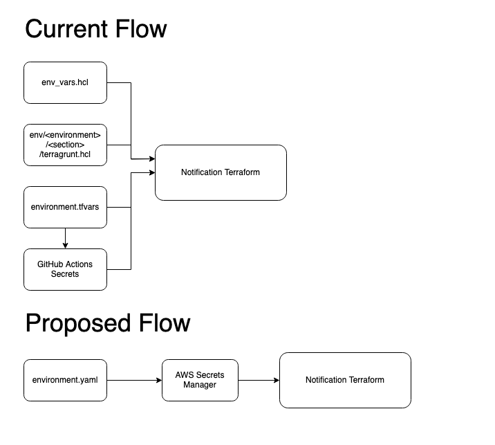

# Terraform Environment Variable Consolidation

Date: 2023-06-28

## Status

**DRAFT**.

## Context

Currently, there are 4 locations in which environment variables and secrets are set within the notification-terraform repository: the TFVars file, github actions secrets, env_vars.hcl, and the individual terragrunt.hcl files within the env\/\<environment>\/\<code-section> of notification-terraform. In addition to being difficult to determine exactly how an environment is configured, it is also confusing when setting up a new environment and introduces situations where there are duplicate variables being set. This ADR describes a solution to consolidate all secrets and environment variables into a single file, creating a "one config file per environment" solution.

## Single YAML Environment File

### Overview

All configuration for an environment is stored in a single yaml file that Terragrunt can read as a "locals" variable. The subsections of this variable are then loaded as inputs in the root terragrunt.hcl file. Each code section of the notification-terraform terragrunt has its own root configuration section in the yaml file, and thus it is easy to quickly navigate to a certain aspect of the infrastructure and view or update the configuration. 




#### Example Environment File
```yaml
# Account Setup
account:
  account_id: "changeme"
  staging_account_id: "changeme"
  new_relic_account_id: "changeme"  

# Global Environment Setup
global:
  env: "example"  
  region: "ca-central-1"
  base_domain: "example.notification.cdssandbox.xyz"
  alt_base_domain: "alpha.example.notification.cdssandbox.xyz"
  ses_custom_sending_domains:
    - custom-sending-domain.example.notification.cdssandbox.xyz
  route53_zone_arn: "changeme"    
  sentinel_customer_id: "changeme"
  sentinel_shared_key: "changeme"  
  billing_tag_value: "notification-canada-ca-example"  
  athena_workgroup_name: "athenawg"  
  configuration:  
    bootstrap: true
    create_cbs_bucket: true
    cbs_satellite_bucket_name: "example-cbs-satellite-419291849580"  
    enable_sentinel_forwarding: false
    enable_delete_protection: false
    force_destroy_s3: true
    force_delete_ecr: true

<truncated for readability> 

# Lambda API Configuration  
api-lambda:
  api_image_tag: "latest"
  api_enable_new_relic: true
  new_relic_license_key: "changeme"
  new_relic_app_name: "notification-lambda-api-example"
  new_relic_distribution_tracing_enabled: "true"  
  dangerous_salt: "changeme"
  ff_cloudwatch_metrics_enabled: "true"
  redis_enabled: "1"
  notification_queue_prefix: "eks-notification-canada-ca"
  performance:
    low_demand_min_concurrency: 1
    low_demand_max_concurrency: 5
    high_demand_min_concurrency: 1
    high_demand_max_concurrency: 10

  # RDS Configuration  
rds:
  rds_cluster_password: "changeme"
  app_db_user: "example"
  app_db_user_password: "changeme"
  dbtools_password: "changeme"
  performance:
    rds_instance_count: 3
    rds_instance_type: "db.r6g.large"

# EKS Configuration
eks:
  eks_cluster_name: "notification-canada-ca-example-eks-cluster"
  eks_cluster_version: "1.25"
  eks_addon_coredns_version: "v1.9.3-eksbuild.3"
  eks_addon_kube_proxy_version: "v1.25.9-eksbuild.1"
  eks_addon_vpc_cni_version: "v1.12.6-eksbuild.2"
  eks_node_ami_version: "1.25.9-20230513"
  performance:
    primary_worker_desired_size: 5
    primary_worker_instance_types: 
      - "m5.large"
    primary_worker_max_size: 7
    primary_worker_min_size : 4

<truncated for readability>
```

### How It Works

To create a new environment it is now as simple as copying the example.yaml, renaming it to a desired environment name, and modifying the configuration as required. In most cases, only the "account" and "global" configuration sections will need to be modified, but all fine grained configuration is easily accessible within the other individual component configuration sections. 

When creating a new environment, a simple bootstrap.sh shell script will first be run to encode the environment yaml file and push it to the AWS secrets manager. 

To run terragrunt against a particular environment, set the environment variable TG_VAR_FILE to the name of the desired environment yaml.

```shell
export TG_VAR_FILE=newenvironment.yaml
```

The root terragrunt.hcl file will automatically load this yaml file, and import the file to locals.environment. In the inputs section of terragrunt.hcl, the locals.environment is then used to populate the individual variables for use by terragrunt.

```hcl
  eks_cluster_name = local.environment.eks.eks_cluster_name
  eks_cluster_version = local.environment.eks.eks_cluster_version
  eks_addon_coredns_version = local.environment.eks.eks_addon_coredns_version
  eks_addon_kube_proxy_version = local.environment.eks.eks_addon_kube_proxy_version
  eks_addon_vpc_cni_version = local.environment.eks.eks_addon_vpc_cni_version
  eks_node_ami_version = local.environment.eks.eks_node_ami_version
```

Terragrunt can then be run normally in each of the individual component directories.

### Additional Benefits

#### Secret Management

Since all variables are now stored in a single file, this file can be stored in AWS Secrets Manager. This will greatly simplify secret management since there is now only a single location to change a secret value. 

#### Automatic Diff Prompts

Two scripts are run as a pre and post hook on any terragrunt plan/apply. 

The first script calls the AWS Secrets Manager and downloads a temporary copy of the environment variable file that is currently stored in the cloud (the source of truth). It then compares this file against the local copy of the file and identifies any differences between the two. If differences are detected, it will prompt the user to verify that the changes are expected before continuing. 

Upon a successful apply, the second script subsequently updates the cloud version of the environment file to ensure that it is always synchronized with the TF State.

#### Reduction of Terragrunt Code

Since all configuration is stored in the yaml file, including the account Ids, it is no longer necessary to have multiple copies of the terragrunt.hcl's for each environment. This can be reduced to a single set of files that can be managed across all environments.

### Drawbacks or Caveats

#### Increased Complexity When Adding a New Variable

Under this model, adding a new variable to terragrunt requires changes in two files instead of one:

variables.tf
As with all terraform solutions, variables must be declared in a variables.tf file

terragrunt.hcl
A new line must be entered in the inputs section of the root terragrunt.hcl to populate the variable with the corresponding value from local.environments (the yaml file)

As a matter of good practice, the example.yaml file should also be updated with the new variable (this is applicable for any solution)

#### Automatic Diff Prompts with Sensitive Values

When running in a Github Actions pipeline, the diff output from the environment variable sync must be suppressed as it has the potential to expose sensitive values. Given that any prompts in a pipeline would cause the job to fail, it may be prudent to simply remove this from pipeline runs.

### Migration Complexity

Since the changes here are not to variables themselves but instead on how they are read into terragrunt, migration is relatively easy and straight forward:

1. Create a new yaml file based off of the example
2. Copy all variable values from the TF Vars file in LastPass to  the appropriate sections in the yaml file
3. Copy all variable values set in the individual terragrunt.hcl files to the appropriate sections in the yaml file
4. Remove all references to variables that aren't dependencies in the terragrunt.hcl files
5. Copy all variable values set in the env_vars.hcl file to the appropriate sections in the yaml file
6. Remove the env_vars.hcl file
7. Modify the Github Actions pipeline to pull the secrets from aws secret manager (a shell script will have to be written)

When complete, terragrung plan should show no changes to the infrastructure since the values remain unchanged.

### Cost

There will be a minimal cost to using AWS Secrets Manager. At 40 cents per month plus 5 cents per 10,000 api calls, it should amount to less than a dollar per environment per month. 

AWS Parameter store is not an option here due to file size limitations.

