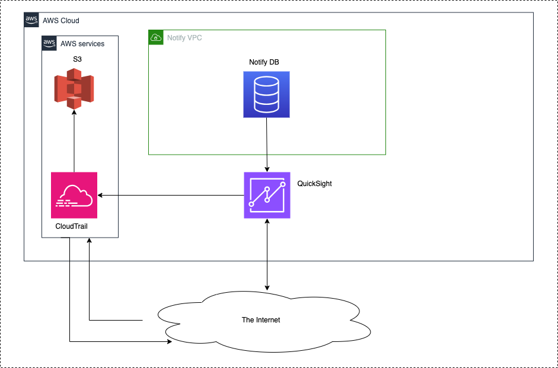

# QuickSight

Date: 2023-11-21

## Status

**DRAFT**.

## Context

To have a thorough understanding of data in our system, the Notify team wanted a collaborative tool that would allow them to explore the database. While we already have installed Blazer, we need a tool with more business intelligence capabilities that is more accessible to non-developers while hiding sensitive data as a default, and showing only with required access level. AWS QuickSight is chosen to be our short / mid term solution for a BI tool that has no sensitive data, that external CDS teams (ie other than Notify) can tap into, and which is easily queryable and fast.

## Requirements

Introducing QuickSight into our system requires us to do the following:

1. QuickSight needs access to the main Notify DB
2. QuickSight needs to be secure and auditable

## Considerations

### Infrastructure as code

QuickSight is an AWS product running in ca-central-1. We can use terraform to create and modify AWS Quicksight subscriptions in our accounts.

### Data

QuickSight imports data from the Notify database into optimized data storage engine called SPICE. This allows queries to run faster and without creating a load on RDS. SPICE datasets (i.e. tables) are updated either manually or on schedule. Updates can either be full or incremental.

We specify the data fields added to the QuickSight datasets. We are excluding any fields containing PII or user data (for example, email addresses, phone numbers, and template personalisation).

QuickSight is outside our VPC and requires a AWS QuickSight VPC connection to access our database.

### Access and data flow

### Data caching

QuickSight imports data into SPICE (Super-fast, Parallel, In-memory Calculation Engine) storage. QuickSight queries run against SPICE and hence do not impact production. SPICE is encrypted at rest.

Most Notify tables are of negligible size. The large tables of interest are the `notifications` table and the `notification_history` table. From preliminary investigations, the (joined) `notifications` table with 1,290,156 rows requires 970 MB of SPICE storage. Our current production `notification_history` table contains 119,706,308 rows and requires 88GB of SPICE.

### Security

#### Auditing

By default QuickSight logs audit events to CloudTrail. We have verified that these events are being fed into Sentinel.

#### User access

QuickSight is configured so that AWS SSO is needed to access the QuickSight subscription. To access the data sets users must also be added one of the QuickSight user groups `dataset-owners` or `dataset-viewers`. Owners may change datasets or add new datasets through the AWS Console (though we will likely do this through terraform). Viewers can only view datasets and use them to create analyses.

#### User roles / permissions

There are three types of QuickSight users: Admins, Authors, and Readers.

Admins can make any changes to the QuickSight account desired, including creating new datasets from RDS (or elsewhere), changing other users's access, and deleting users, datasets, dashboards, or even deleting the QuickSight subscription entirely.

Authors can create dashboards from datasets they have access to.

Readers can view dashboards.

By default no users have access to the datasets. Users must be manually added to one of our QuickSight user groups: `quicksight-dataset-owners` and `quicksight-dataset-viewers`. Admins and authors in either dataset can use the datasets to create dashboards. Members of `quicksight-dataset-owners` may delete or edit datasets, for example changing or renaming fields, refreshing the data from RDS, or changing the refresh schedule. Eventually most of these actions should be in terraform, however, so we may eventually eliminate this group.

QuickSight has the ability to create more granular user permissions. For example, we can restrict access to certain datasets or columns of datasets to a smaller subset of users. This may be useful if we allow PII or data derived from PII (email domains, for example) to be added to QuickSight.

There are different roles for which this finer control could be beneficial with. For example:

* Support: Read access to recent notifications and users data.
* Research: Read and write access to historic notifications and users data.
* Growth: Read and write access to historic notifications and users data.
* Executives: Read access to historic notifications and users data.

This is an example of how we could start with for current needs and not an official
permissions matrix. Building a matrix of data resources with access level for each
group of users will come with use cases that will present in the future.

### Cost estimates

Note that all dollar amounts are in US dollar. Costs associated with QuickSight include:

* $24/month per admin or author.
* $0.30/session for a reader (user that can only view dashboards), up to $5/month max per user.
* $0.38/GB per month for extra SPICE (each admin or author account includes 10 GB of free SPICE)

For production we can roughly estimate:

* 10 admins or authors (total)
* 10 readers
* SPICE requirements approximately 100 GB initially

The total cost in this case would be $290/month (no additional SPICE purchase required)

Note that the October 2023 cost for Staging QuickSight was $72 (for 3 users).

## Additional considerations

QuickSight is meant to serve our BI tool needs in GCNotify team on short and mid term. This likely
might not be our long-term solution. There is an internal initiative that evaluates additional BI tools
with considerations for the whole platform organizations.

## Decision

QuickSight has been approved by the Platform Core team for current projected cost, in the context
of the current prototype testing that is going on.

In order for QuickSight to continue long term, we would need to:

* get an evaluation done with a comparative analysis of other BI tools (ongoing),
* get a security assessment by the security team,
* get approved by policies,
* approved and authorized by management.

## Consequences

The foreseem short and mid term consequences are summarized as such:

1. Increased security by isolating the sensitive data from roles that do not require to read these,
1. Increased performance compared to SQL tools querying directly the database; BI tools are meant to be queries fast on-the-spot,
1. Increased reliability as the queries run into an environment that is not associated with our application environments.

_TODO: Add long term consequences, aftermath and chosen long term solution._
