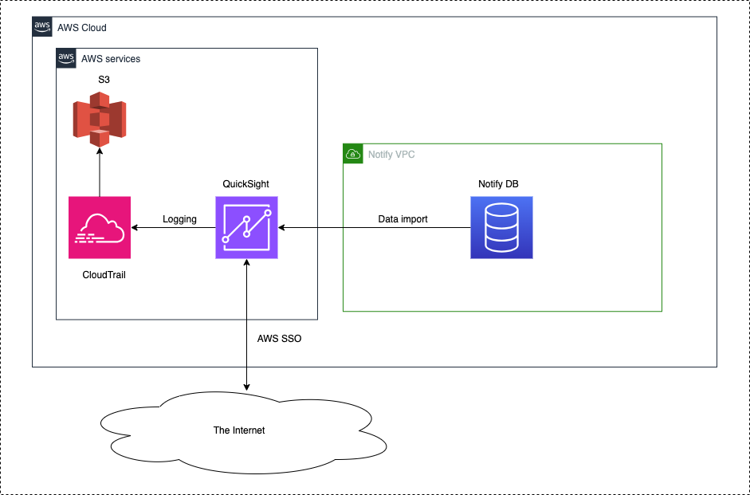

# QuickSight

Date: 2023-11-21

## Status

**DRAFT**.

## Context

To have a thorough understanding of data in our system, the Notify team wanted a collaborative tool that would allow them to explore the database. While we already have installed Blazer, we need a tool with more business intelligence capabilities that is more accessible to non-developers. AWS QuickSight was chosen to be our short/mid term solution for a BI tool that has no sensitive data, that external CDS teams (ie other than Notify) can tap into, and which is easily queryable and fast.

## Implementation

Introducing QuickSight into our system requires us to do the following:

1. QuickSight needs access to the main Notify DB
2. QuickSight needs to be secure and auditable

## Deployment

### QuickSight

QuickSight is an AWS product that we can run in ca-central-1. We can use terraform to create and modify AWS Quicksight subscriptions in our accounts.

### Data

QuickSight imports data from the Notify database into optimized data storage called SPICE. This allows queries to run faster and without creating a load on RDS. SPICE datasets (ie tables) are updated either manually or on schedule. Updates can either be full or incremental.

We specify the data fields added to the QuickSight datasets. We are excluding any fields containing PII or user data (for example, email addresses, phone numbers, and template personalisation).

QuickSight is outside our VPC and requires a AWS QuickSight VPC connection to access our database.

### User access

QuickSight can be configured so that AWS SSO is needed to access the QuickSight subscription. To access the data sets users must also be added one of the QuickSight user groups `dataset-owners` or `dataset-viewers`. Owners may change datasets or add new datasets through the AWS Console (though we will likely do this through terraform). Viewers can only view datasets and use them to create analyses.

### Auditing

QuickSight can be configured to log audit data to CloudTrail.

### Diagram

### Data caching

QuickSight imports data into SPICE (Super-fast, Parallel, In-memory Calculation Engine) storage. QuickSight queries run against SPICE and hence do not impact production. SPICE is encrypted at rest.

Most Notify tables are of negligible size. The large tables of interest are the `notifications` table and the `notification_history` table. From preliminary investigations, an unjoined `notifications` table with 1,204,073 rows requires 387.2 MB of SPICE storage. Our current production `notification_history` table contains 116,581,601 and so should require approximately 38 GB of SPICE. A notification_history table joined with services, templates, and organisations will require approximately ?? storage.

### User roles / permissions

There are three types of QuickSight users: Admins, Authors, and Readers. 

Admins can make any changes to the QuickSight account desired, including creating new datasets from RDS (or elsewhere), changing other users's access, and deleting users, datasets, dashboards, or even deleting the QuickSight subscription entirely.

Authors can create dashboards from datasets they have access to.

Readers can view dashboards.

By default no users have access to the datasets. Users must be manually added to one of our QuickSight user groups: `quicksight-dataset-owners` and `quicksight-dataset-viewers`. Admins and authors in either dataset can use the datasets to create dashboards. Members of `quicksight-dataset-owners` may delete or edit datasets, for example changing or renaming fields, refreshing the data from RDS, or changing the refresh schedule. Eventually most of these actions should be in terraform, however, so we may eventually eliminate this group.

### Cost estimates

Note that all dollar amounts are in US dollar. Costs associated with QuickSight include:
- $24/month per admin or author.
- $0.30/session for a reader (user that can only view dashboards), up to $5/month max per user.
- $0.38/GB per month for extra SPICE (each admin or author account includes 10 GB of free SPICE)

For production we can roughly estimate:
- 10 admins or authors (total)
- 10 readers
- SPICE requirements around 80 - 100 GB

The total cost in this case would be $290/month (no additional SPICE purchase required)

Note that the October 2023 cost for Staging QuickSight was $72 (for 3 users).

## Additional considerations

_TODO: Describe extras in here._

## Decision

_TODO: Describe the way forward._

## Consequences

_TODO: Describe foreseen and felt consequences of the decision (possible after 1-3 months)._
