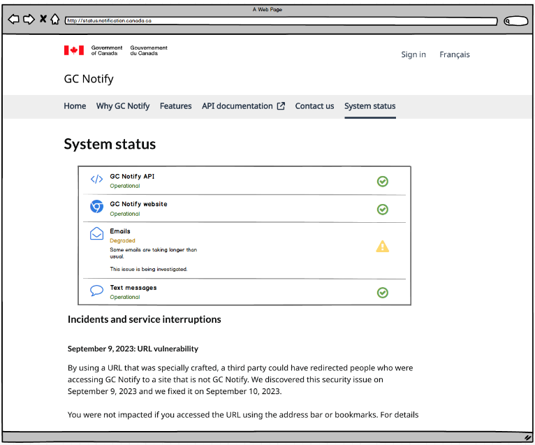

# System status
Date: 2023-11-27

## Status

**DRAFT**

## Context

The system status page will be made up of two sections:
1. The component status section: a quick reference for users to see how well the components of GC Notify are currently performing
2. Incident and service interuptions list: a textual list of current and historical incidents that affect performance, along with a description and impact

## Components to monitor

The status of the following components will be displayed:
- The GC Notify website
- The GC Notify API
- Email sending
- SMS sending

### Component statuses
Each system component can be rated as one of the following statuses:
- Up
- Degraded
- Down

Each component will have its own criteria for determining its status, based on our [SLO](https://notification.canada.ca/service-level-objectives) where possible.

### Proposed component status definitions
| Component   | Status   | Definition                                                                             |
| ----------- | -------- | -------------------------------------------------------------------------------------- |
| Website     | UP       | The website is responding to requests in 400ms or less                                 |
| Website     | DEGRADED | The website is responding to requests in more than 400ms                               |
| Website     | DOWN     | The website is not responding                                                          |
|             |          |                                                                                        |
| API         | UP       | The API is responding to requests in 400ms or less                                     |
| API         | DEGRADED | The API is responding to requests in more than 400ms                                   |
| API         | DOWN     | The API is not responding                                                              |
|             |          |                                                                                        |
| Email       | UP       | Priority emails are sending within 60s, and Other emails are sending within 45m        |
| Email       | DEGRADED | Priority emails are taking longer than 60s, or Other emails are taking longer than 45m |
| Email       | DOWN     | No emails sent within the last 5 minutes                                               |
|             |          |                                                                                        |
| SMS         | UP       | Priority SMSs are sending within 60s, and Other SMSs are sending within 45m            |
| SMS         | DEGRADED | Priority SMSs are taking longer than 60s, or Other SMSs are taking longer than 45m     |
| SMS         | DOWN     | No SMS messages sent within the last 5 minutes                                         |

## Monitoring
Each system will need to be monitored every 5m to determine which status it is in.

## Systems architecture
The website that shows system status needs to be deployed separately from the main GC Notify website so that we can continue showing status information even if the GC Notify website is down.  It should not live within our existing EKS node.

### Front-end
A new front-end website will be deployed to show the status information.  It will be served from a new domain, status.notification.canada.ca.  This site does not have to mirror the exact look and feel of the current Notify website.

### Back-end
A new back-end API wil be deployed that will be responsible for assessing the status of each component of the system.

### Deployment

#### Api Code
We have two options to deploy the API's associated with the system architecture page.
1. API-lambda
    We can change the current heartbeat API lambda to make all the API calls required for the system status page.
1. ECS Cluster
    We can set up an ECS task (similar to Blazer/Perf-tests) to allow all the API calls

Given we use both versions in our current code base and neither has any significant advantage over the other, we are going to use the API lambda (Option 1)

The API lambda needs to accomplish the following things:
1. Make HTTP requests to Admin and API to get reponse times
1. Perform a query to the DB to get average response times of heartbeats sent in the last 5 minutes, by notification type and priority
1. Write the responses to a Github Repository (commit a .json file every 5 minutes to /responses dir)
1. Clean up the responses directory once a day (either through the lambda or a github workflow)
1. Set up terraform to call the lambda once every 5 minutes similar to [heartbeat-lambda](https://github.com/cds-snc/notification-terraform/blob/main/aws/heartbeat/lambda.tf#L20)

The API Lambda will interact with 2 different systems:
1. Public endpoints to check response times
1. The Notify DB to determine time for sends

We will write all the above results into a singular .json and commit it to github.
We should use multi-processing so all endpoints are fired up and run in parallel vs sequence.

### Github Pages
Github can host static webpages.
The github repo will display status.notification.canada.ca

#### The final flow will look like

API Lambda -> Github Repo -> Static Page

### Considerations

1. What happens if github pages are down?
   We don't have a good solution here. The status page will be down. We could in theory build resiliency by setting up another server, but for MVP we will not take this into account.

## Status checks
- The website/API/File upload checks can all be done via simple HTTP requests to the respective systems.  No special permissions or rights are required.
    - **Question**: Can we leverage [the CDS status page](https://github.com/cds-snc/status-statut) for this?
    - **Answer**: Since we will only perform a few simple response time checks, it will be simpler for us to do this directly in the backend API.
- For email and SMS, we will need to assess the actual sending time for each priority of each message type (email and SMS).  These checks will require read access to the notify database in order to calculate sending time.
   - The healthcheck lambda should be extended to send a notification of each type and priority, and we can use these to assess the health of the email and sms sending functions.

## Code architecture
Two new code repositories will be created, one for the new API and one for the new front-end website.

## Designs
### All systems operational

### Some systems degraded

## Release model
This feature can be release in 2 phases:
1. The status page with the component status section including only the HTTP status checks + incident and service interuptions list
2. The addition of the email and SMS sending status checks

## Message SLO breaches in November
Visualizing the days of November where email and SMS messages exceeded the target send time SLO.

### Email
#### Priority

#### Normal

#### Bulk

### SMS
<!-- trunk-ignore(markdownlint/MD024) -->
#### Priority

<!-- trunk-ignore(markdownlint/MD024) -->
#### Normal

<!-- trunk-ignore(markdownlint/MD024) -->
#### Bulk

### Total Overview

## Site response times Nov 29 - Dec 4

- Detailed response time data [can be found here](https://docs.google.com/spreadsheets/d/1yVFrbtXB31l20eaKkfBJlQdo1KAY3DVZIglc-4nErLA/edit?usp=sharing)

## Future considerations
### Notification callbacks
In the future we may add additional status checks for:
- how long it takes for the delivery receipt callback to happen
- the response time of the document download API

## Decision

_TODO: Describe the way forward._

## Consequences

_TODO: Describe foreseen and felt consequences of the decision (possible after 1-3 months)._
