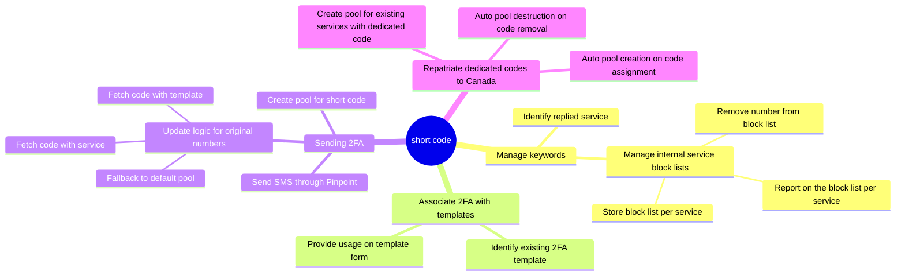

# TITLE

Date: 2024-02-13

## Status

**DRAFT**.

## Related ADRs

- [Add a short-code to Notify](https://github.com/cds-snc/notification-adr/blob/main/records/2021-09-20.scalibility.notify-short-code.md)

## Context

As the GCNotify team just acquired a short code and because it it currently
restricted to two-factor authentication only, the software needs a mechanism
to associate it only with templates of 2FA nature, i.e. the short code meant
to send 2FA should be used to send 2FA SMS.

At the current time, because the short code is sitting along long codes and all
of these are in a default pool, that means that all codes are randomly used to
send SMS, including the short codes. Hence the latter can be used to send
SMS messages that are non-related with 2FA.

To overcome this issue:

- we need to isolate the short code and long codes within their own group that will be identified with proper usage,
- we need a way to identify the templates with two-factor authentication.

The ability to create a group of codes has extra benefits that we can leverage
on top of solving the current issue:

- the ability to have a formal random pool of long codes,
- the ability to assign multiple dedicated long codes to one service,
- the ability to repatriate the existing dedicated long codes from the us-west-1 region into the ca-central-1 and align better with our own policies of sending from Canada exclusively.

### Overhaul of SMS sending

This fits into our vision for a general overhaul of how we send SMS. The
following areas along with broad tasks are envisioned at the time of this
writing:

## Options

Below are the different options that are considered to group SMS codes
together.

### Option 1: Leverage AWS Pinpoint pools

Create a phone pool in AWS Pinpoint for regular long codes which act as a
fallback. Create a pool containing the short code. Resurrect the Pinpoint
implementation to send SMS and leverage the botocore Pinpoint API to send
messages identified with a specific phone pool.

#### Pros

- Fast to implement

#### Cons

- Still cannot track which numbers that were used.
- Have to use Pinpoint with a more complicated API. We have an old implementation that we can revive for this purpose.

### Option 2: Roll out our own pool implementation

Create a phone pool in AWS Pinpoint for regular long codes which act as a
fallback. Create a pool containing the short code. Implement a pool feature
of our own with all phone numbers we have. This option would provide great
flexibility and improved monitoring, allowing us to decide exactly which code
sends which SMS and pick desired strategy such as the round-robin strategy to
favor. However, this option requires more changes and time.

#### Pros

- Improved monitoring of used numbers.
- Our own alagorithm for code selection.

#### Cons

- More effort to implement compared to other solutions.

## Additional considerations

_TODO: Describe extras in here._

## Decision

_TODO: Describe the way forward._

## Consequences

_TODO: Describe foreseen and felt consequences of the decision (possible after 1-3 months)._
