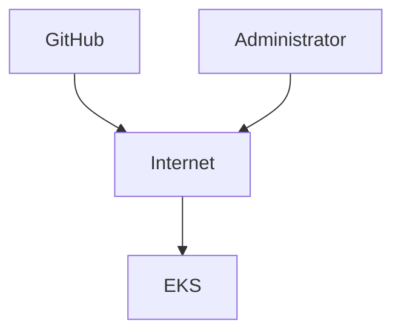
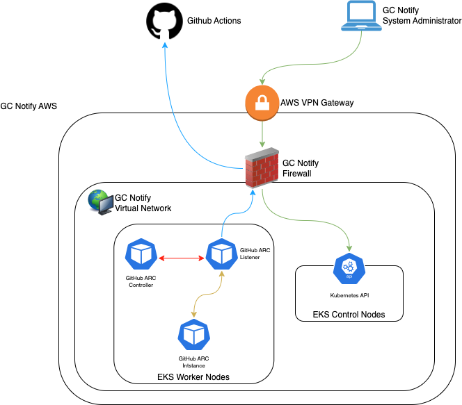

# Converting To A Private EKS Cluster

Date: 2024-02-15

## Status

**DRAFT**.

## Context

GC Notify hosts a large portion of its system in an AWS managed Elastic Kubernetes Service. When deploying an EKS cluster, there is the option to make the main administrative endpoint either public or private. Public endpoints are available to the entirety of the internet, but protected by the AWS IAM and Single-Sign-On. Private endpoints are also protected by AWS IAM and SSO but are also not accessible via the open internet. 

Currently, GC Notify is using a public administration endpoint, which is typically not recommended for sensitive workloads. This ADR will go over the pros and cons of public vs private EKS clusters.

## Options

### Public EKS Cluster

Using a public EKS cluster means keeping that status-quo for GC Notify. When the EKS cluster is deployed, a random AWS DNS entry is created, which resolves to a public IP exposing the GC Notify EKS API endpoint.  

#### Considerations

##### Access Control

Access control is provided by using the CDS AWS SSO solution. A user that has authenticated with AWS and has the necessary permissions is able to log in and administer the cluster.

##### Security

Because the API is exposed as a public endpoint, a user would be able to access the API from any system anywhere in the world, so long as they are able to authenticate with CDS and AWS. This provides flexibility for supporting the system.

This also means that the API is exposed to malicious actors. Although authentication is required to actually access the system, this still leaves it vulnerable to zero day attacks, DDoS attacks, and other security threats. 

This may not conform to AC-17 of ITSG-33 government security requirements.

##### Integration With GitHub

Being a public endpoint, it is possible to provide GitHub direct connectivity to the cluster API. This has the benefit of simplifying release management with our CICD workflows in GitHub Actions. By granting GitHub access, any Kubernetes or Helm changes can be executed from the public GitHub Action Runners.

##### Administrative Overhead

There is little to no administrative overhead when using a public endpoint since this is the default state for AWS EKS clusters. 

### Private EKS Cluster

Using a private EKS Cluster requires the use of a VPN to connect to the cluster for administrative tasks. When the cluster is deployed, it will be unreachable unless connected via our AWS VPN endpoint for that particular environment.

   
#### Considerations

##### Access Control

Access control is provided by using the CDS AWS SSO solution. A user that has authenticated with AWS and has the necessary permissions is able to log in and administer the cluster.

##### Security

Because the API endpoint is no longer exposed to the internet, any user needing to administer the cluster would have to use the appropriate GC Notify VPN connection. This would limit the ability of providing support to devices that have already been set up to connect to this VPN system. 

This also means that the API will be shielded from any external threats, and in a better position to mitigate zero day attacks. 

This is typically a requirement to satisfy AC-17 of ITSG-33 government security requirements.

##### Integration With GitHub

Running GitHub Actions that need to perform Kubernetes related tasks is more complex due to no direct connectivity to the EKS Cluster. Instead, in order to leverage GitHub Actions, it is required to install the [GitHub Actions Runner Controller](https://github.com/actions/actions-runner-controller) (ARC) into the target Kubernetes cluster. This turns the CICD model from push to pull in that ARC will poll the necessary repositories and when it detects changes, will create a GitHub Actions Runner **inside** the Kubernetes cluster. This has been completed as a proof of concept in the GC Notify Development Environment. 

At a high level, the following steps are required:
1. Generate a Personal Access Token in GitHub with the necessary permissions
1. Install the GitHub Actions Runner Controller as a deployment in the Cluster (Deployed by Helmfile)
1. Install the Actions ScaleSet as a ScaleSet in the Cluster (Deployed by Helmfile), providing the PAT and the target repository URLs.
1. Generate a Personal Access Token (PAT) in GitHub with the necessary permissions
1. Install the GitHub Actions Runner Controller as a deployment in the Cluster (Helm)
1. Install the Actions ScaleSet as a ScaleSet in the Cluster (Helm), providing the PAT and the target repository URLs.
1. Modify the workflows that must be run internally to run on the ScaleSet by setting runs-on to the install name of the Actions ScaleSet

##### Administrative Overhead

Switching to a private EKS cluster doesn't add any administration by itself, however there is maintenance required in deploying and maintaining ARC. Additionally the default runner image provided by ARC does not include the same tools offered by the GitHub hosted runner images. It was, and will be necessary to create and self-manage a docker image that contains the necessary pre-requisites for GC Notify. 

## Decision

_TODO: Describe the way forward._

## Consequences

_TODO: Describe foreseen and felt consequences of the decision (possible after 1-3 months)._
