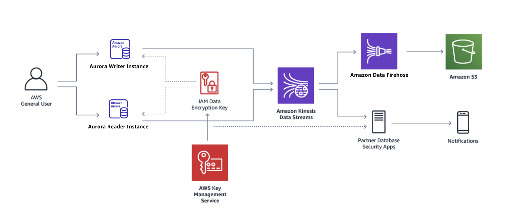

# Database activity logging

Date: 2024-04-05

## Status

**DRAFT**

## Context

To improve GC Notify's security posture, database activity logging should be enabled.  This will give the product and security teams visibility into the database activity.  It will also allow for the creation of automated alerting rules to detect malicious or unusual behaviour.  

This work is related to the most recent Security Assessment and Authorization (SA&A) performed on Notify, which identified the [AU-6 - Audit Review, Analysis, and Reporting](https://www.cyber.gc.ca/en/guidance/annex-3a-security-control-catalogue-itsg-33#a33au6) control as required.

## Options

There are two options for auditing database activity with an RDS Aurora PostgreSQL database cluster:

1. [database activity streams](https://docs.aws.amazon.com/AmazonRDS/latest/AuroraUserGuide/DBActivityStreams.Overview.html); and
2. the [PostgreSQL audit extension (pgAudit)](https://docs.aws.amazon.com/AmazonRDS/latest/AuroraUserGuide/Appendix.PostgreSQL.CommonDBATasks.pgaudit.html).

### Option 1: database activity streams

A database activity stream logs all queries performed by the databases that are part of an Aurora cluster. The activity stream is encrypted with a KMS Customer Managed Key (CMK) and can be integrated with other AWS services.  No database instance configuration or storage space is needed to setup and use the activity stream.

The proposed solution for GC Notify would be to create an asynchronous activity stream to minimize database performance impact.  This stream would then be ingested by a Kinesis Firehose which would:

1. decrypt the activity events,
1. filter events that should not be captured; and 
1. write activity logs to an S3 bucket for auditing and alerting.

_Figure 1: [Database activity stream architecture](https://docs.aws.amazon.com/AmazonRDS/latest/AuroraUserGuide/DBActivityStreams.Overview.html#DBActivityStreams.Overview.how-they-work)_

In order to respect Notify's privacy policy, the S3 activity logs would be deleted after 7 days.

### Option 2: PostgreSQL audit extension (pgAudit)

The pgAudit extension uses the built-in PostgresSQL logging infrastructure and extends the log messages with more detail.  Logs are written to the database instances in the cluster and then published to a CloudWatch log group for auditting and alerting.  A database cluster parameter group is used to [configure which database activity is logged](https://docs.aws.amazon.com/AmazonRDS/latest/AuroraUserGuide/Appendix.PostgreSQL.CommonDBATasks.pgaudit.html#Appendix.PostgreSQL.CommonDBATasks.pgaudit.reference).

The proposed auditing solution using pgAudit would be to:

1. enable pgAudit using the database cluster's parameter group,
1. install and configure the pgAudit extension, and
1. publish audit logs to a CloudWatch log group with a 7 day expiration setting.

When using pgAudit, it is important to be [mindful of which queries are being logged](https://github.com/pgaudit/pgaudit/blob/master/README.md#usage-considerations).  This is because the audit logs are stored on the database instance and can lead to disk space exhaustion and performance issues if too much data is logged.

## Additional considerations

Database performance impact, cost and customization of which events are logged are the chief considerations.

## Decision

Based on the above, the decision has been made to use database activity streams.  This has the following benefits:

1. Negligible impact to database performance.
1. S3 audit log storage costs are low.
1. No requirement to manage database instance storage or audit log cleanup.
1. No requirement to install database extensions or modify the database configuration.
1. High degree of customization around which database activity events are stored.

## Consequences

### Increased cost
The activity logs in S3, Kinesis Firehose data ingestion and KMS key activity will raise costs.  Monitoring will be needed to ensure the increased costs are reasonable.

### Performance impact to the database
Although asynchronous activity streams should have very little impact to the database performance, this will need to be tested before deploying to production.

### Unsanitized query data appearing in plaintext
The activity stream events contain all database queries.  This could include sensitive, unsanitized query data that will be stored in plaintext in the S3 bucket.  This is similar to the risk that currently exists with Blazer, but it introduces a new location for the data.  

This risk can be mitigated by ensuring access to the S3 activity log bucket is restricted and/or adding query sanitizing to the Kinesis Firehose's processing Lambda function.  
