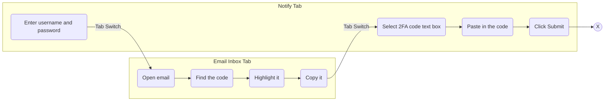
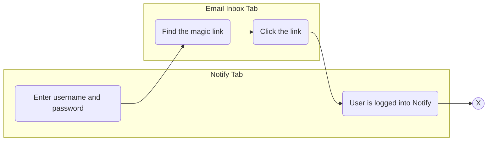

# Add magic links to 2FA emails

Date: 2024-04-11

## Status

**DRAFT**.

_VALUES: (DRAFT, IN REVIEW, APPROVED, REJECTED)_

## Context

Notify requires users to manually copy two factor authentication codes from their email then paste it into a text box on the site in order to log into Notify. This process is cumbersome and not that accessible, or easy to use.

The aim of this initiative is to improve the accessibility and ease of use of Notify's login process.

## Options

### Increase the visibility of 2FA codes in emails
The simplest approach is to increase the visiblility of codes in the email to make the code more obvious and easier to interact with:
- Place the code on it's own line in the email
- Bold or otherwise highlight the text
- Increase font size

While increasing visibility is an improvement, it does not address the cumbersome amount of actions needed to complete the login:

### Use magic links
By using a magic link that the user can simply click on to complete the login process, we reduce the number of manual interactions required by the user to log in, thus making the process less obstructive and feel more natural.

## Security Considerations
While the addition of magic links provides users with a less cumbersome, more accessible and convenient login experience there are a number of security implications to leveraging them.

### Email Impersonation
A malicious actor could send a user, who just logged in, an email containing a magic link of their own. This link could redirect the user to a phishing site enabling the malicious actor to collect partial auth information from the user trying to log in, providing a window where the attacker could obtain unauthorized access to Notify.

The attack surface, while not impossibly small, relies on a number of time limited circumstances to be aligned for this type of attack to succeed:

1. The attacker needs to know the moment the user clicked the sign-in button
2. The attacker needs to send their phishing email before the legitimate email is received to maximize their success -OR- they would need to execute a man-in-the-middle attack to modify the legitimate email's magic link to point to the malicious site.
3. If the attacker succeeds in phishing and retrieving partial login information, they would also need access to the real magic link that we sent to the user in order to successfully log in.

#### Mitigation

A potential mitigation to this attack vector would be to establish a process for generating a hashed unique visitor fingerprint. This fingerprint could be ephemerally stored for the duration of a magic link's validity period. That fingerprint could then be validated upon clicking a magic link, before beginning the final steps of the login process. This would allow us to differentiate a legitimate user from one who attempts to

This fingerprint could use the user's browser attributes, IP address, HTTPS session key, etc. Ideally some random composition of avaible attributes would be used to reduce the predictability of the data elements used to create a unique fingerprint, and thus pose a greater challenge to attackers should they attempt to replicate this hash. Since the success of the attacker is highly time dependent, [Argon2d](https://github.com/P-H-C/phc-winner-argon2) would be a good candidate for such an hashing implementation as it uses data-depending memory access to make it resistant to GPU based brute force attacks.

#### Considerations
While a unique fingerprint hashed with Argon2d could be an appropriate solution to thwart this type of phishing attack there are several considerations that add to the scope of such an implementation:

* Policy and Legal implications of collecting users' browser attributes and / or IP addresses.
* The increase in AWS costs, and system performance, related to running the Argon2d hashing algorithm for each login.
  * Argon2 can [fill up to 1GB or RAM in a fraction of a second](https://github.com/P-H-C/phc-winner-argon2/blob/master/argon2-specs.pdf) (page 3) however it's memory usage can be manually tuned.

## Decision

## Consequences

_TODO: Describe foreseen and felt consequences of the decision (possible after 1-3 months)._
