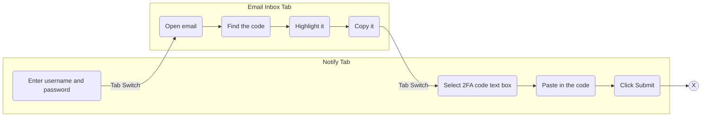
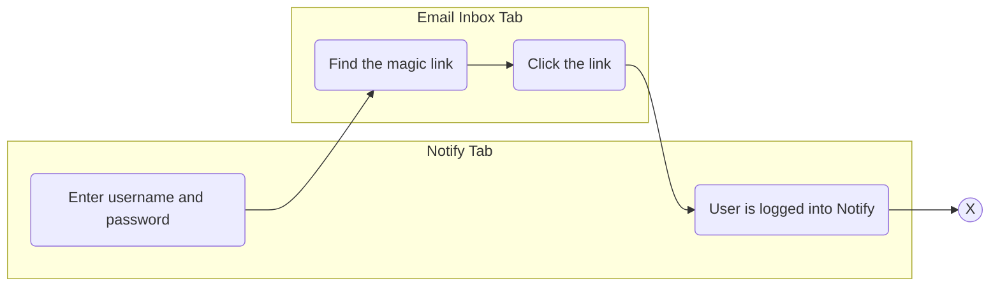
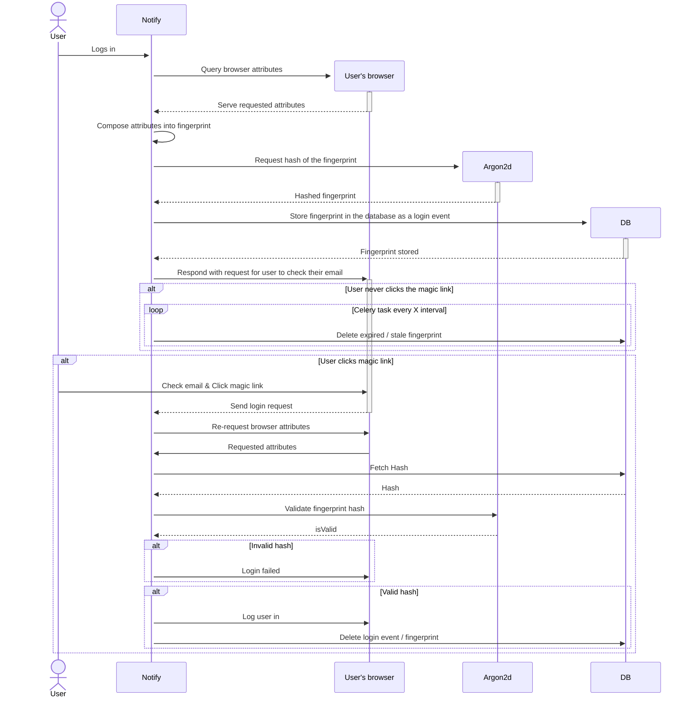

# Add magic links to 2FA emails

Date: 2024-04-11

## Status

**DRAFT**.

_VALUES: (DRAFT, IN REVIEW, APPROVED, REJECTED)_

## Context

Notify requires users to manually copy two factor authentication codes from their email then paste it into a text box on the site in order to log into Notify. This process is cumbersome and not that accessible, or easy to use.

The aim of this initiative is to improve the accessibility and ease of use of Notify's login process.

## Options

### Increase the visibility of 2FA codes in emails
The simplest approach is to increase the visibility of codes in the email to make the code more obvious and easier to interact with:
- Place the code on it's own line in the email
- Bold or otherwise highlight the text
- Increase font size

While increasing visibility is an improvement, it does not address the cumbersome amount of actions needed to complete the login:

### Use magic links
The industry standard for magic links is to provide passwordless login for users. They are a token based authentication strategy that act as a replacement for password input.

In the context of Notify, magic links can be adapted to serve as a simpler second step in the two-factor authentication process. After inputting their username and password, the user checks their email and clicks the magic link to complete the login process. With this approach we can make the login process simpler and more accessible by reducing the number of steps required by the user to log in, thus making the process less obstructive and feel more natural.

## Security Considerations
While the addition of magic links provides users with a less cumbersome, more accessible and convenient login experience there are a number of security implications to leveraging them.

### Session cookie leaks via Cross-Site-Scripting
Once a user inputs their username and password, a partially authenticated session cookie is created that could, theoretically, be used by an attacker to gain unauthorized access to Notify. For this to succeed the attacker needs:

1. Access to a user's partially authenticated cookie.
2. Access to  the user's email inbox to obtain their magic link.
   * Man-in-the-middle attack to obtain the user's magic link.

#### Mitigations
* CSRF protections buit into Flask, and which are already enabled in our application, configure the `Set-Cookie` header with the `HttpOnly` and `Secure` options, preventing Javascript from reading the contents of the session cookie, and limits the cookie(s) to HTTPS traffic only

* The `Strict-Transport-Security` header is enabled site wide, converting all requests to HTTPS, thus mitigating man-in-the-middle attacks.

* Introduce a process for checking that the `Origin` header matches the target origin when a magic link is followed. As our application is distributed and lives behind a load balancer, making each node aware of it's target origin could prove to be non-trivial task and/or have unintended consequences.

See the [Fallback Mitigation section](#Fallback-Mitigation---An-over-engineered-"last-resort"-solution)

### Email Phishing
An attacker could tamper with the 2FA email we send to the user and forward them to a phishing site that prompts them to re-input their username and password. If the user is not aware of this type of risk they could unintentionally provide an attacker with their log in credentials.

In this instance, the attacker now has a means to create their own partially authenticated session cookie, and would only need access to the magic link. If they have successfully tampered with the 2FA email, we can assume the attacker already has the means to obtain the magic link, even without direct access to the user's inbox.

#### Mitigations
* Provide guidance to inform users of the risks of magic links, and steps they can take to mitigate them.
* See the [Fallback Mitigation section](#Fallback-Mitigation---An-over-engineered-"last-resort"-solution)

###

## Fallback Mitigation - An over-engineered "last resort" solution

A fallback mitigation layer to protect against scenarios that are out of our control would be to establish a process for generating a unique visitor fingerprint. This fingerprint could be ephemerally stored for the duration of a magic link's validity period. That fingerprint could then be validated once the user clicks the magic link, and before beginning the final steps of the login process.

The fingerprint could use the user's browser attributes, IP address, HTTPS session keys, etc to form a composite key that could then be hashed to uniquely identify the user. Since the success of the attacker is time dependent, [Argon2d](https://github.com/P-H-C/phc-winner-argon2) could be a good candidate for such a hashing implementation as it uses data-depending memory access to make it resistant to GPU based brute force attacks.

Such an approach could allow us to regain control over some scenarios that typically arise from user action and behaviour that is out of our control:

* The user's device is compromised
* The user's email inbox is compromised
* The user forwards their 2FA link to unauthorized parties
* The user falls victim to phishing attacks

## Considerations
While a unique fingerprint hashed with Argon2d could be an appropriate fallback solution to thwart these types of attacks there are several considerations that add to the scope of such an implementation:

* Policy and Legal implications of collecting users' browser attributes and / or IP addresses.
* The increase in AWS costs, and system performance, related to running the Argon2d hashing algorithm for each login.
  * Argon2 can [fill up to 1GB or RAM in a fraction of a second](https://github.com/P-H-C/phc-winner-argon2/blob/master/argon2-specs.pdf) (page 3) however it's memory usage can be manually tuned.
* Level of effort - this solution would likely not be trivial to implement, and/or maintain in the future.

## Decision

## Consequences

_TODO: Describe foreseen and felt consequences of the decision (possible after 1-3 months)._

##### sources:
* https://cheatsheetseries.owasp.org/cheatsheets/Cross-Site_Request_Forgery_Prevention_Cheat_Sheet.html#dealing-with-client-side-csrf-attacks-important
* https://flask.palletsprojects.com/en/2.3.x/security/#cross-site-scripting-xss