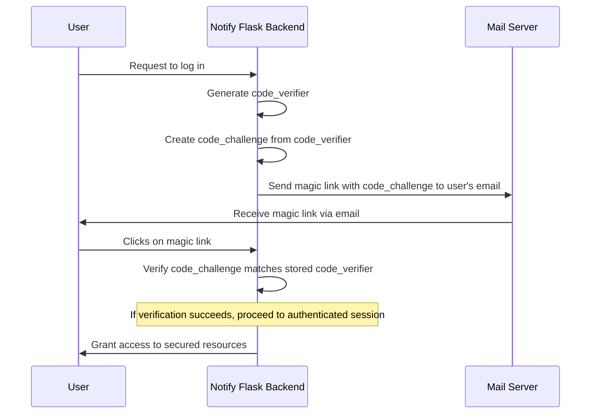

# Notify 2FA using Magic Links and a PKCE-like mechanism

Using a mechanism similar to OAuth 2.0's Proof Key for Code Exchange (PKCE) for the verification of magic links can be a robust and secure alternative to the [proposed solution](https://github.com/cds-snc/notification-adr/pull/64/files), even if Notify isn't using OAuth itself.
This approach leverages the principles of PKCE, originally designed to secure OAuth against interception attacks, and can similarly enhance the security of any process where tokens or links are exchanged.
Some downsides of the already proposed solution (with Argon2D), that the PKCE-like mechanism could solve:
* Policy and Legal implications of collecting users' browser attributes and / or IP addresses
* An increase in AWS costs, and system performance, related to running the Argon2d hashing algorithm for each login
* Level of effort - this solution would likely not be trivial to implement, and/or maintain in the future.

# Concept Overview

PKCE uses a pair of related tokens, the code_verifier and the code_challenge, to secure the exchange:
* Code Verifier: A high-entropy cryptographic random string generated by the client, which is kept secret and used later to verify the authenticity of the request.
* Code Challenge: A derived version of the code_verifier, usually created by hashing the code_verifier and sending it over the network (in PKCE, this is sent to the authorization server during the initial request).

# Applying PKCE-like mechanism to Magic Links

In the context of magic links used for 2FA:
1. Magic Link Generation:
    - When the magic link is generated, also generate a code_verifier (a secure random string). This acts as a secret known only to the server and the legitimate user's session.
    - Compute a code_challenge from this code_verifier. For example, using SHA-256 hash and then base64-url encode the result. The code_challenge is embedded into the magic link as a parameter.
2. Magic Link Usage:
    - When a user clicks on the magic link, they are directed to a verification page (or endpoint) where the code_challenge is sent back to the server.
    - The user’s session (or another secure store) must retain the code_verifier. When the code_challenge is received, the server recalculates it from the stored code_verifier to confirm if the challenge matches what was expected.

# Implementation Example
```python
import hashlib
import base64
import os

def generate_code_verifier():
"""Generate a secure random code_verifier."""
  return base64.urlsafe_b64encode(os.urandom(32)).rstrip(b'=').decode('utf-8')


def create_code_challenge(code_verifier):
  """Derive code_challenge from code_verifier using SHA-256."""
  digest = hashlib.sha256(code_verifier.encode('utf-8')).digest()
  return base64.urlsafe_b64encode(digest).rstrip(b'=').decode('utf-8')


def verify_code_challenge(code_verifier, received_challenge):
  """Verify the received code_challenge against the expected one."""
  expected_challenge = create_code_challenge(code_verifier)
  return expected_challenge == received_challenge
```

### Usage
```python
code_verifier = generate_code_verifier()
code_challenge = create_code_challenge(code_verifier)

# Embed the code_challenge in the magic link URL
magic_link = f"https://notify-link.ca/verify?code_challenge={code_challenge}"

# Later, during verification
is_valid = verify_code_challenge(stored_code_verifier, received_code_challenge)
```

# Considerations
* Session management: Ensure that the code_verifier is securely stored and managed in a user’s session or another secure, temporary store.
* Hash function: Choose a secure hash function, like SHA-256, to avoid vulnerabilities related to weak cryptographic functions.

The security of the PKCE-like mechanism we’re considering here for Notify’s magic links largely depends on the attacker's inability to reverse-engineer or guess the code_verifier from the code_challenge. This mechanism is robust if implemented correctly.

Potential vulnerability if an attacker gains access to the magic link containing the code_challenge.
1. Hash Breaking: if an attacker obtains the code_challenge, they would need to break the hash to recover the original code_verifier. With strong cryptographic hash functions like SHA-256, this is currently considered computationally infeasible.
2. Brute Force or Guessing: the strength of the code_verifier depends on its entropy. It should be sufficiently random and long enough (recommended minimum length is 43 characters) to make brute force attacks impractical.
3. Man-in-the-Middle (MITM) Attacks: if an attacker can intercept the transmission of the magic link, they also need to intercept the HTTP request where the code_verifier is finally used. Secure transmission channels (HTTPS) and proper session handling can mitigate this risk.
4. Endpoint Security: if the endpoint that accepts and verifies the code_challenge has vulnerabilities, such as improper session handling or other server-side flaws, it could be exploited to bypass the protection offered by PKCE.


# Implementation Considerations for Enhanced Security
Use HTTPS: always use HTTPS to prevent MITM attacks. Ensure that your transport layer security is correctly configured and up-to-date.
Strong Code Verifier: ensure that the code_verifier is generated using a cryptographically secure method and has high entropy.
Secure Server and Application: protect endpoints that handle the code_verifier and code_challenge. Implement proper security measures like rate limiting and monitoring to detect and mitigate brute-force attempts.
Validate the Implementation: regularly review and test the implementation to ensure that there are no bugs or weaknesses that could be exploited. Include penetration testing as part of your security regimen.

# Conclusion
While having access to the magic link with the code_challenge embedded gives an attacker some information, without additional weaknesses in the system or the ability to reverse-engineer the hash, they cannot easily compromise the code_verifier. The key to maintaining this security is rigorous adherence to best practices in cryptographic security and application hardening.
Mermaid flowchart
to depict the authentication flow with the use of a PKCE-like mechanism for magic links in a 2FA process. This includes the generation of the code_verifier and code_challenge, and their subsequent use in the authentication process.


# Explanation of the Diagram
- User (U): Represents the individual trying to access the secured resources.
- Flask Notify Backend (F): Represents Notify’s Flask application handling the login requests, generating and verifying the code_verifier and code_challenge, and ultimately managing session authentication.
- Mail Server (M): Represents the email service used to send the magic link to the user.

# Steps Detailed
1. User Request: The user initiates a login request.
2. Generate Verifier: The Flask app generates a code_verifier, a cryptographically secure random string.
3. Create Challenge: The Flask app then uses the code_verifier to generate a code_challenge by hashing the verifier.
4. Send Magic Link: The app sends an email through the mail server containing the magic link with the embedded code_challenge.
5. User Action: The user receives the email and clicks on the magic link.
6. Verification: When the magic link is accessed, the Flask app verifies that the code_challenge matches the expected value derived from the stored code_verifier.
7. Grant Access: If the verification is successful, the user is granted access to the secured resources.