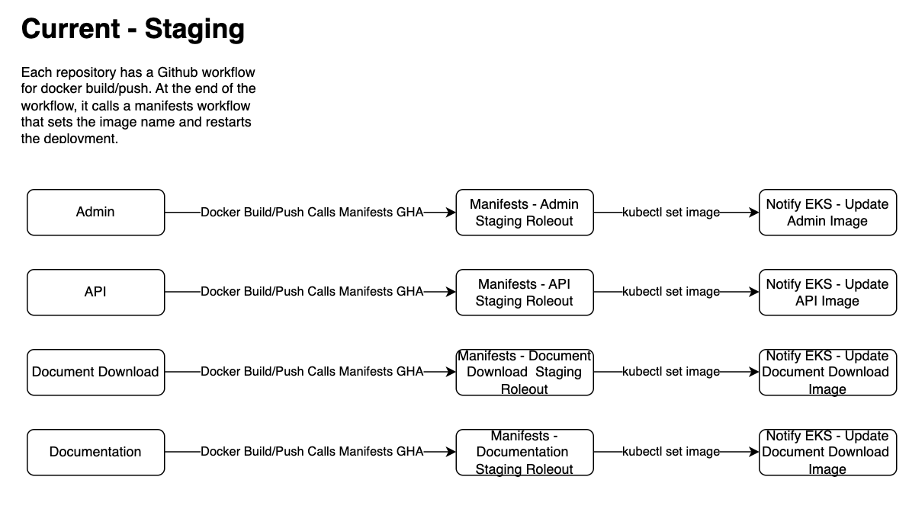
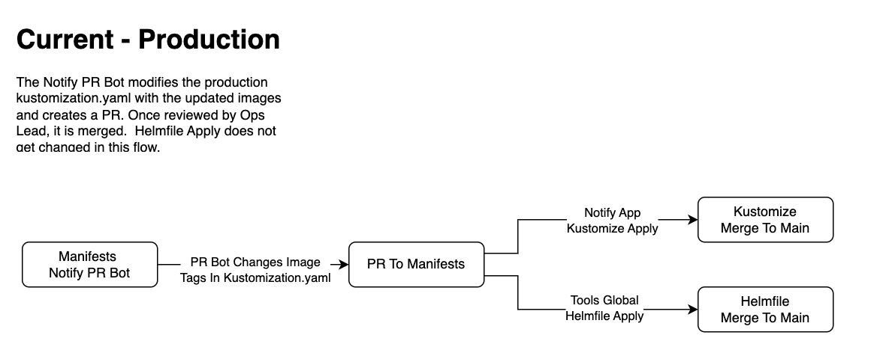
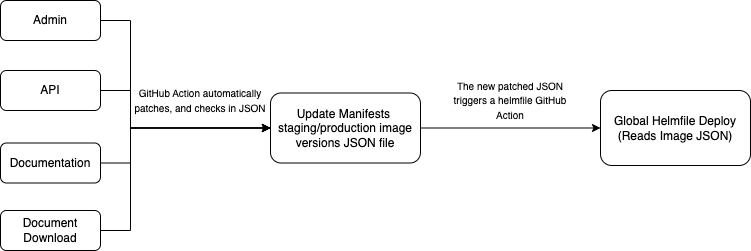

# Current Manifests CI/CD

Date: 2024-06-04

## Status

**DRAFT**.

## Related ADRs

For information on how manifest rollouts are done using GitHub ARC Runners please see this ADR:
[Private EKS Cluster](2024-02-15.private-eks-cluster.md)

## Context

The way the CI/CD works for releases for manifests is not well documented. This ADR outlines the the CI/CD release process for staging and production, the current problems we face with this model, and proposed solutions moving forward.

## Current State

### Staging

#### Individual Application Rollouts

When deploying a new version of the application components (admin/api/document-download etc), the release to staging is kicked off at the application repository level when the docker image is built. The docker image tag is based on the first 7 digits of the github runner sha, and also tags this build as latest. The docker build and push workflow invokes a corresponding workflow in the notification-manifests repository passing the new docker tag to have it deployed to staging.

The manifests rollout workflow receives the new image tag and performs a manual patch of the existing deployment:

```shell
kubectl set image deployment.apps/api api=$DOCKER_SLUG:$DOCKER_TAG -n=notification-canada-ca
```

##### Staging - current process



#### Global Manifests Rollouts

When a global manifests rollout is performed by the merge to main (staging) github workflow, all of the Kustomize code is deployed.

```shell
notification-manifests/env/staging kubectl apply -k .
```

### Production

#### Individual Application Rollouts

This concept does not exist for production. We only rollout all of Kustomize.

#### Global Manifests Rollouts

Every night, the Notify PR Bot reads the latest github commit sha's for each repository, and if they've changed, creates a pull request that changes the image tag values in the Kustomization.yaml for production. Once this is merged, all of the kustomize code is deployed at once.

Since the PR bot does not touch the helmfile side of things, we also do a single global apply on helmfile with "latest" tags.

#### Production - current process 



### Problems

#### Two Different Deployment Technologies

We are currently managing two different Kubernetes deployment methods with Kustomize and Helmfile. It would be beneficial to have everything under one technology.

#### Staging Releases

Because we do not actually update any manifests code when doing an individual application rollout, we lose all context of which version we should be using when we do a global manifest rollout with merge to main (staging). To overcome this, the staging Kustomize code is set to always use the "latest" tag. This means when we apply kustomize the explicitly versioned docker tag is overwritten with "latest". This works because the docker build and push job for each application tags as both latest and the github sha. It is however not ideal since it becomes difficult to track versions in staging, and also creates a delta between how staging and production releases are handled through release pipelines.

This issue is a problem regardless of whether we use Kustomize or Helmfile.

#### Helmfile Image Versions

For helmfile releases, we are relying on the helmfile logic to set the image versions in the overrides. For example, we may have something like the code block below, which hard codes the tag for production, but accepts either an environment variable or will default to "latest" if it does not exist.

```yaml
      {{ if eq .Environment.Name "production" }}
      image:
        tag: release1.24
      {{ else }}
      image:
        tag: {{ env "DOCKER_TAG" | default "latest" }}
      {{ end }}
```

This is an ok solution, but it's not ideal to have to modify the individual override files to set image versions for production manually. It would be ideal to have this done automatically like with the PR bot.

## Options

Because Helmfile has been identified as a long term goal to migrate GC Notify to, the options below will all involve moving the Kustomize code to Helmfile.

### Option 1: Migrate Everything to Helmfile Keeping the Existing CI/CD Processes

The first option is to simply move Notify to helmfile, and adapt the existing CI/CD process. This will be a relatively easy change as most of this work has been completed in a manifests branch. The Notify PR bot will have to be modified to change the image tag in the overrides files of helmfile instead of the Kustomization.yaml file.

The staging deployments would remain exactly the same as they are now.

#### Diagram


#### Pros

- Least effort
- Consolidates all Kubernetes resources to a single technology
- Introduces the ability to add "Diff" previews to Notify Applications on manifests PRs

#### Cons

- Does not solve the release process differences between staging and production

### Option 2: Per-Environmnent Centralized Image Version File

The second option is to try and overhaul the CI/CD process in staging to make it more consistent with production, while also maintaining the flexibility of rapid deployments to staging. We could create a github action in each notification-x repo that automatically modifies a centralized <environment>_image_versions.json file. When this change is merged to main, a manifests job would trigger a new deploy to either staging or production.

#### Diagram



#### Pros

- Consolidates all Kubernetes resources to a single technology
- Introduces the ability to add "Diff" previews to Notify Applications on manifests PRs
- Staging and Production have the same release process

#### Cons

- More complex - will need to enable/disable branch protection when updating the image.json

## Additional considerations

These are high level concepts only. In addition to the release processes above, we would have to integrate helmfile diff into the PRs, which currently must be done in manifests only. We are working on a solution that will allow Github to hit the private EKS cluster directly via VPN which would reduce a lot of complexity around this.

## Decision

_TODO: Describe the way forward._

## Consequences

_TODO: Describe foreseen and felt consequences of the decision (possible after 1-3 months)._
