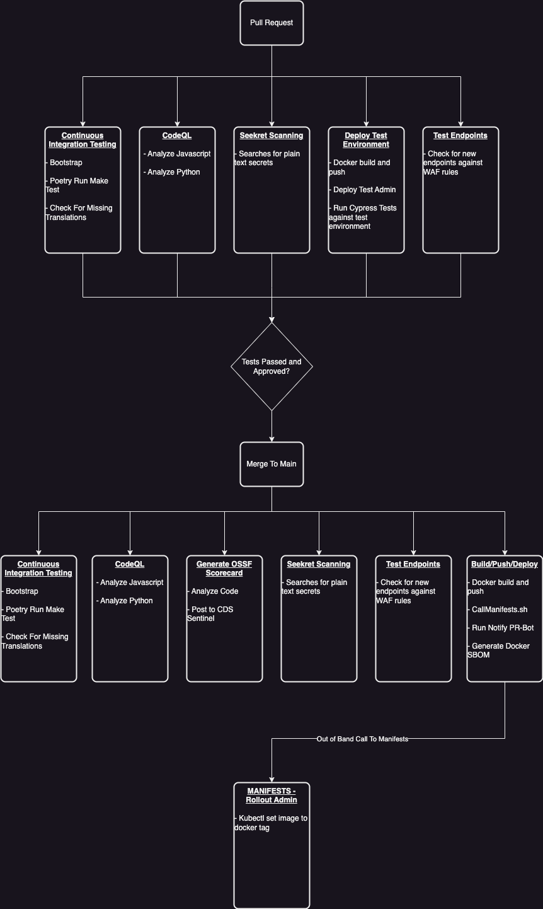
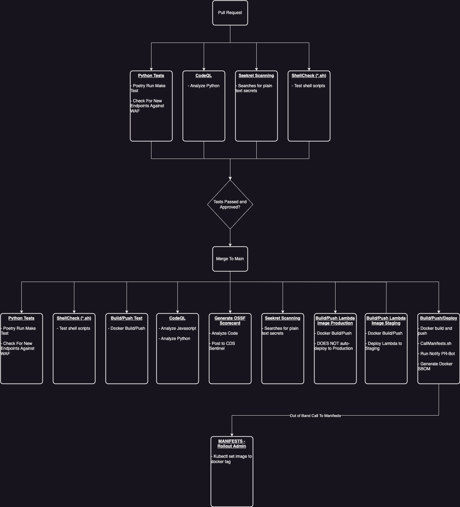
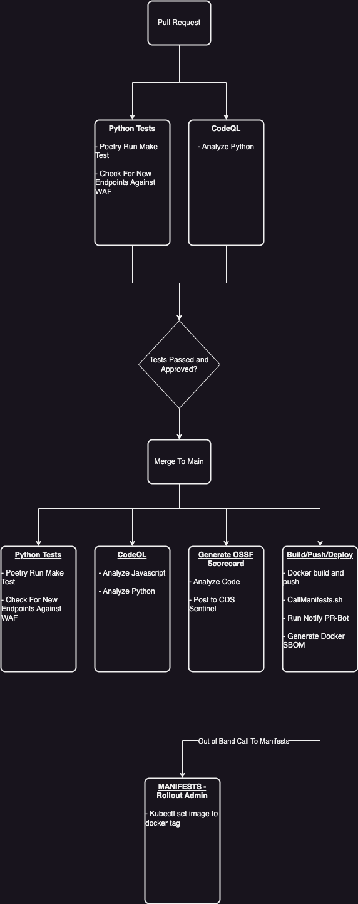
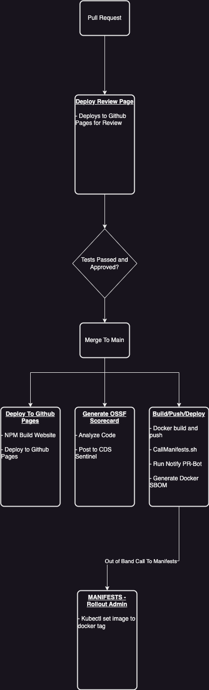
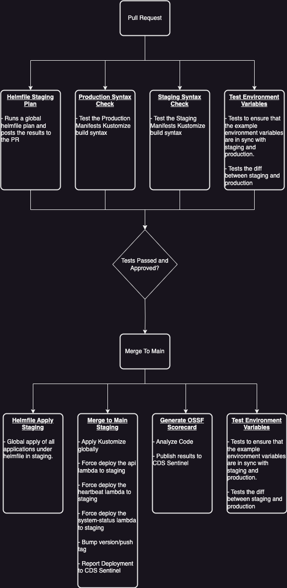
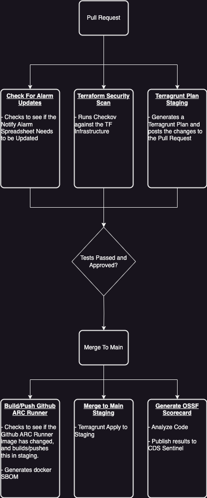
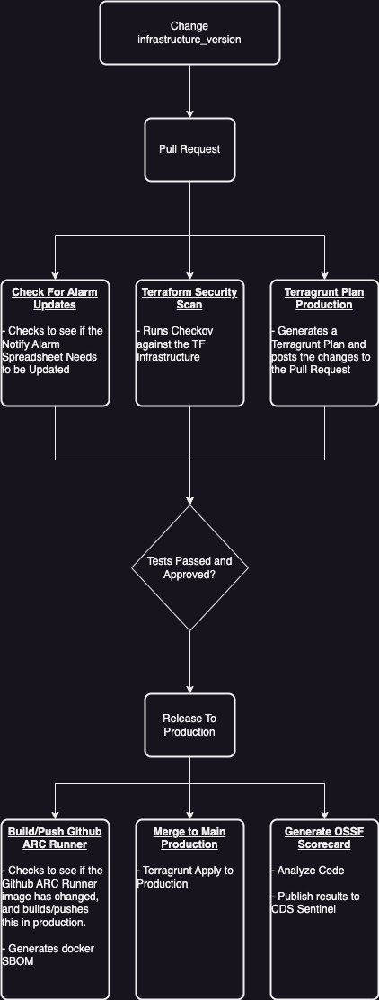
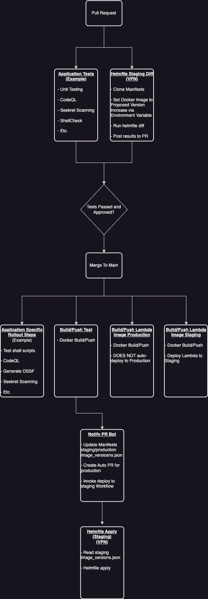

# Current Manifests CI/CD

Date: 2024-06-04

## Status

**DRAFT**.

## Related ADRs

For information on how manifest rollouts are done using GitHub ARC Runners please see this ADR:
[Private EKS Cluster](2024-02-15.private-eks-cluster.md)

## Context

The Notify CI/CD is currently a complex setup consisting of several different release paradigms. This ADR outlines the current state of the Notify CI/CD as well as the problems associated with this and proposes options for simplifying the CI/CD while also improving the consistency of the release process.

## Current State

### Staging

#### Individual Application Rollouts

When deploying a new version of the application components (admin/api/document-download etc), the release to staging is kicked off at the application repository level when the docker image is built. The docker image tag is based on the first 7 digits of the github runner sha, and also tags this build as latest. The docker build and push workflow makes a HTTP call to invoke a corresponding workflow in the notification-manifests repository (which runs on the internal Github runners) passing the new docker tag to have it deployed to staging.

The manifests rollout workflow receives the new image tag and performs a manual patch of the existing deployment:

```shell
kubectl set image deployment.apps/api api=$DOCKER_SLUG:$DOCKER_TAG -n=notification-canada-ca
```

##### Admin Pull Request and Merge To Main



##### API Pull Request and Merge To Main



##### Document Download API Pull Request and Merge To Main



##### Documentation Pull Request and Merge To Main



#### Kustomize/Helmfile/Manifests Pull Request and Merge To Main

When a global manifests rollout is performed by the merge to main (staging) github workflow, all of the Kustomize code is deployed.

```shell
notification-manifests/env/staging kubectl apply -k .
```



##### Terraform Pull Request and Merge To Main



### Production

#### Individual Application Rollouts

This concept does not exist for production. We only rollout all of Kustomize.

#### Global Manifests Rollouts

The Notify PR Bot generates an auto-pr on every merge to main in each of the application Github repositories (see above). The PR bot does not touch the helmfile side of things, so a global helmfile apply is done when a production release is executed.

#### Kustomize/Helmfile/Manifests Production Release


##### Terraform Production Release



### Problems

#### Two Different Deployment Technologies

We are currently managing two different Kubernetes deployment methods with Kustomize and Helmfile. It would be beneficial to have everything under one technology.

#### Different Release Process For Staging and Production

Manifests code is not actually changed when doing a release to staging, thus making it difficult to track changes and perform effective rollbacks.

#### Different Release Process Between Terraform and Manifests

Terraform does not use the notify-pr-bot to generate automatic PRs for Terraform changes. This creates unnecessary toil for the ops lead when doing Terraform releases.

#### Staging Releases Get Trampled

Because we do not actually update any manifests code when doing an individual application rollout, we lose all context of which version we should be using when we do a global manifest rollout with merge to main (staging). To overcome this, the staging Kustomize code is set to always use the "latest" tag. This means when we apply Kustomize the explicitly versioned docker tag is overwritten with "latest". This works because the docker build and push job for each application tags as both latest and the github sha. It is however not ideal since it becomes difficult to track versions in staging, and also creates a delta between how staging and production releases are handled through release pipelines.

This issue is a problem regardless of whether we use Kustomize or Helmfile.

#### No Ability to Preview Manifests Changes

Because Kustomize lacks any sort of "diff" functionality, we are unable to know exactly what will happen when we release to staging or production. This creates uncertainty on releases and introduces the risk of deploying unwanted changes. There have been several incidents related to this issue.

#### Self-Hosted Github ARC Runners

The self-hosted Github ARC runners are currently required since the EKS cluster is private. This introduces additional complexity, and a new failure point. There have already been several incidents where the ARC runner failed to run, delaying our releases.

## Proposed Solution

### Step 1: Remove Github ARC Runners In Favor of VPN

We can create a secondary VPN endpoint in AWS that uses certificate based authentication instead of SAML based. This will allow standard Github runners to remotely connect to our Kubernetes API, and remove the necessity of internal Github ARC Runners.

There would be an increased cost to this solution, but it could be mitigated by reducing the number of connected subnets to each VPN from 3 to 1. Tests have been run to verify that connectivity to the other subnets remains.

#### Problems Solved

- Using self hosted Github runners introduces complexity and additional work.

#### Pros

- Less complexity involved for managing releases
- Completely removes the requirement of Github ARC
- Removes potential security risks inherent to Docker in Docker
- Removes the "Chicken and Egg" scenario where we can't use Github Actions to deploy Kubernetes code until the Kubernetes cluster is set up.

#### Cons

- Adds an additional VPN endpoint to manage

### Step 2: Migrate Kustomize to Helmfile and Leverage a Centralized Image Version Registry

We can migrate all of Notify to helmfile. This will be a relatively easy change as most of this work has been completed in a manifests branch. New files would be created in the manifests repository - one for production, and one for staging - with the docker image versions for the applications explicitly set. When rolling out, helmfile would read from these files to update the environment.

The Notify PR bot will have to be modified to change the image tag in these new files instead of Kustomization.yaml, and would have to do it for both staging and production (currently it only does production).

Finally, a new workflow in manifests would need to be created to automatically deploy to staging when a new PR has been created.

#### Problems Solved

- Staging and Production do not adhere to the same release process.
- In Manifests, there is no ability to preview changes being applied to production.
- In Manifests, when deploying to staging, explicitly tagged docker images get replaced with "latest".
- The release process is different between infrastructure (Terraform) and the application (Manifests).

#### Pros

- Consolidates all Kubernetes resources to a single technology
- Introduces the ability to add "Diff" previews to Notify Applications on manifests PRs
- Staging and Production release process is the same.
- All deployments to the Kubernetes cluster are centralized to manifests.

#### Cons

- Moderate amount of effort required

### Diagram of Steps 1 and 2

The following diagram simplifies the individual application workflow steps and covers only the changed rollout/release process steps.



### Step 3: Implement Notify PR Bot for Terraform

We can modify the Notify PR Bot to also work for Terraform, which would reduce the amount of toil required by the Ops lead for deploying Terraform releases, and align the release process with manifests.

#### Pros

- Simplified release process for Ops Lead
- Release process between Manifests and Terraform is consistent

#### Cons

- Additional work required on the pr bot
- Javascript sucks

## Decision

We decided to adopt the proposed solution. This long-term approach will require some time but offers significant benefits.

## Consequences

As of May 2025, we have implemented steps 1 and 2 of the proposed solution. This proved to be very useful and the pros were delivered as planned. The Helm migration took some effort but we now have a more controlled way to deploy with the list of differences between environments. The migration brought a few issues as we heavily refactored our environment variables handling. On the plus side, this was a good clean up opportunity.

The ARC runners were removed in favor of the VPN. We are closer to our organization security standards.

We are still considering the step 3, which has not been implemented yet within notification-pr-bot.
