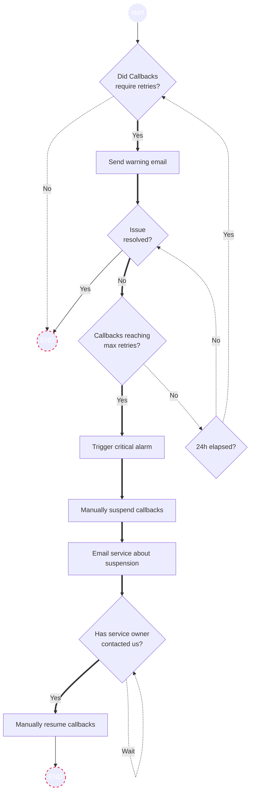

# TITLE

Date: 2024-08-14

## Status

**DRAFT**.

_VALUES: (DRAFT, IN REVIEW, APPROVED, REJECTED)_.

## Related ADRs

_TODO: Related ADRs that this ADR is built upon or that this one extends._

## Context

_TODO: Describe context that triggered the writing of this ADR._

Notify currently offers delivery of notification callbacks, containing info such as notification delivery status, recipient, and delivery date, for services who choose to configure them. When a callback fails to be delivered to the service's callback API, Notify will attempt to resend the callback up to 5 times, with 5 seconds in between each request before dropping the callback all together.

As 100% uptime of the service's callback API cannot be guaranteed, Notify experiences spikes in processing demands when services send a large number of notifications while their API, to receive callbacks, is down. `E.g. 1000 notifications sent while the service is down = 5000 requests that we are responsible for fulfilling`. As Notify grows, both in the number of active services and total notification throughput, so will the processing demand associated with fulfilling callbacks.

This ADR introduces mitigation strategies to reduce system load, in the scenario where a callback service is down and the associated Notify service is continuing to send notifications.

## Options

### Trigger alarms to prompt manual suspension of a service's callbacks

### Alarms
[Some alarms have already been implemented.](https://github.com/cds-snc/notification-terraform/commit/40f105da8df7e4cf89ae418bef4be96e888f00b4)

Thresholds subject to change.*

#### Warning Alarm

Callbacks fail consistent delivery, requiring retries before being delivered successfully.
- **5 notification callbacks** failed delivery within **15 minutes**

#### Critical Alarm

Callbacks reach max retries and fail delivery entirely.
- **5 notification callbacks** fail, exceeding the max retries of five within **30 minutes**.

### Process flow

When a service's callbacks fail to be consistently delivered:

1. A warning alarm is triggered.
2. An email is sent to the service owner, alerting them of issues with their callback API.

The warning email will be sent no more than once per day, per callback URL. Currently a service can only have one URL configured at a time but in the event that the URL is updated we will send additional emails in the same day.

If, after the warning email is delivered, availability continues to degrade resulting in callbacks being dropped due to exceeding the max retries:

1. A critical alarm is triggered.
2. A Notify team member (ops lead?) would use the platform admin UI to pause callbacks for that service.
3. As part of the pause process, GCNotify sends an [email](https://github.com/cds-snc/notification-api/pull/2190/files#diff-a7de7566620064ea85eacda53163429be50282374a124c93fc04bc5f637a5dcbR29) to the service owner so they are aware of issues on their end and that their callbacks are paused.
4. The service owner resolves the issues with their callback API, and contacts us.
5. We resume their callbacks again, via the platform admin UI.

### Implementation overview
To keep track of which services are currently suspended and when the suspension took place we will add two new columns to the `services` table:

- `callbacks_suspended`
- `callbacks_suspended_at`

## Additional considerations

_TODO: Describe extras in here._

## Decision

_TODO: Describe the way forward._

## Consequences

_TODO: Describe foreseen and felt consequences of the decision (possible after 1-3 months)._
