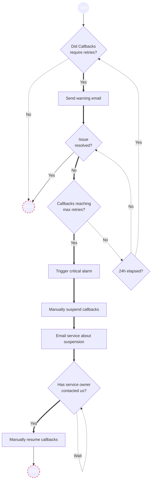

# Suspension and resumption of service callbacks

Date: 2024-08-14

## Status

**DRAFT**.

## Context

_TODO: Describe context that triggered the writing of this ADR._

Notify offers the delivery of notification callbacks, containing info such as notification delivery status, recipient, and delivery date, for services who choose to configure them. When a callback fails to be delivered to the service's callback API, Notify will attempt to resend the callback up to 5 times, with a 5 seconds retry back off, before dropping a callback all together.

The drawback of this retry mechanism is that Notify can experience spikes in processing demands in certain scenarios. Since 100% uptime of a service's callback API cannot be guaranteed, when a service sends a large number of notifications while their API is down this it results in a spike in processing demands.

For example, if a service sends 1000 notifications while their API is down then Notify is responsible for fulfilling 5000 requests to that service's callback API. As Notify grows, both in the number of active services and total notification throughput, so will the processing demand associated with fulfilling callbacks.

This ADR introduces mitigation strategies to reduce system load in the scenario where a callback service is down, and an associated Notify service is continuing to send notifications.

## Options

## Trigger alarms to prompt manual suspension of a service's callbacks

### Alarms
[Some alarms have already been implemented.](https://github.com/cds-snc/notification-terraform/commit/40f105da8df7e4cf89ae418bef4be96e888f00b4)

Thresholds subject to change.*

#### Warning Alarm

Callbacks fail consistent delivery, requiring retries before being delivered successfully.
- **5 notification callbacks** failed delivery within **15 minutes**

#### Critical Alarm

Callbacks reach max retries and fail delivery entirely.
- **10 notification callbacks** fail, exceeding the max retries of five within **30 minutes**.

### Process flow

When a service's callbacks fail to be consistently delivered:

1. A warning alarm is triggered.
2. An email is sent to the service owner, alerting them of issues with their callback API.

This warning email will be sent no more than once per day, per callback URL. Currently a service can only have one URL configured at a time but in the event that the URL is updated we will treat it as a new service and send an additional email in the same day.

If after the warning email is delivered, availability continues to degrade and callbacks are still being dropping due to exceeding the max retries then we will:

1. Trigger a critical alarm.
2. Use the platform admin UI to pause callbacks for that service.
3. GCNotify sends an [email](https://github.com/cds-snc/notification-api/pull/2190/files#diff-a7de7566620064ea85eacda53163429be50282374a124c93fc04bc5f637a5dcbR29) to the service owner, making them aware of issues with their API.
4. Resume the service's callbacks, via the platform admin UI, once the service owner contacts us

#### Visualized flow

### Implementation overview
To keep track of a service's suspension status and when the suspension took place we will add two new columns to the `service_callback_api` table:

- `suspended`
- `suspended_at`

When the platform admin UI is used to suspend a service's callback, we will set `suspended` to `True` and record the time in the `suspended_at` column. By storing these values we facilitate tracking of suspended services so they can be easily displayed in the platform admin UI to be quickly resumed after the service resolves the issues with their API and contacts us.

Should we automate the suspension and resumption process later down the road, the `suspended_at` column will provided us with the context we need to determine when we can automatically resume a service's callbacks. (e.g Time has reached a pre-defined threshold and we resume their callbacks.)

## Additional considerations

### The burden of manual intervention
As of now it is rare that a callback API goes down during larger sends, resulting in strain on the system, therefore manual intervention should suffice at this time.

However if this issue occurs more frequently, particularly as Notify grows, then we should consider automating the suspension and resumption process in order to eliminate the burden of manual intervention, and maintain our velocity as a team.

## Future considerations
### Maintaining data quality as Notify grows
Completeness, consistency, reliability and timeliness are pillars of data quality. While service owners are responsible for maintaining uptime of their API, in the case of their service going down, it's fair to assume the onus is on them to improve their uptime.

As of today, there are only 39 services making use of callbacks. As Notify grows it may be of greater importance to understand how services are using callback data and how integral it is to their operational requirements.

When we intervene and choose to stop the delivery of callbacks to a service, we potentially trade a service's data quality for system performance. After adequate research on how services use this data, we should consider and relate these findings to any potential reputational and policy implications of choosing to suspend a service.

### Detaching the callback handling task from thread-bound http calls constraint

At the time of this writing, our Celery task that handles API callbacks are bound to one process/thread as these run on a Python implementation with the Global Interpreter Lock. To alleviate the risk of a scenario where a failing callbacks constantly times out and locks all process/threads available to the Celery callback handling tasks, we could move away from a synchronous/thread-bound model.

1. Use a Python asynchronous solution that unlocks the thread to process other network calls until the HTTP calls timeout. For this solution, this would need to play well with the Celery framework to preserve its retry feature.
1. Use a Python asynchronous solution that unlocks the thread to process other network calls until the HTTP calls timeout. For this solution, we would move away from Celery but keep on using Python. We need to preserve the retry features that Celery natively offers without using Celery.
1. We can move that piece of logic into AWS lambda. Starting a lambda would be similar to a process/thread except that we can launch as many as we want and these would handle high spikes pretty well typical to notification bursts that GCNotify experiences. We need to preserve the retry features that Celery natively offers without using Celery.
1. Stay within the Kubernetes space but move to a technology different than Python such as NodeJS or other. NodeJS would be a good candidate as it naturally queues up waiting green threads in the background until it expires/times out. We need to preserve the retry features that Celery natively offers without using Celery.

Tackling this issue would allow us to tackle callbacks faster and more reliably, without the impact to other services and other GCNotify's components. The users would still need to manage their callback APIs properly but that would highly reduce the risk when they are not doing it.

### Redesign the current thread-bound sending implementation
We currently send callbacks to a user's API service via the `requests` library. `requests` is not a multi-threaded library and therefore contributes to slow downs associated with delivering callbacks. An alternative approach should be considered that detaches us from the current thread-bound implementation, as a means to improve performance.

- Leverage thread pools.
- Use an async library like [`GRequests`](https://github.com/spyoungtech/grequests) to parallelize the request and ensure callback delivery is a non-blocking task.
- Delegate callback tasks to dedicated, independently scalable celery pods.

## Decision

The frequency that we see slowdowns related the callbacks is rare. With this in mind we will move forward with the implementation outlined above in the `Options` section. We will trigger warning and critical alarms that will prompt manual delivery of warning emails, and suspension of a service's callbacks respectively. New options will be added to the platform admin pages to facilitate manual intervention.

## Consequences

_TODO: Describe foreseen and felt consequences of the decision (possible after 1-3 months)._

