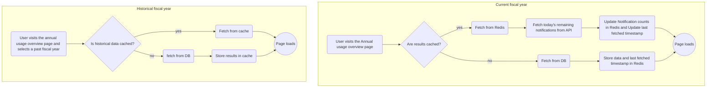
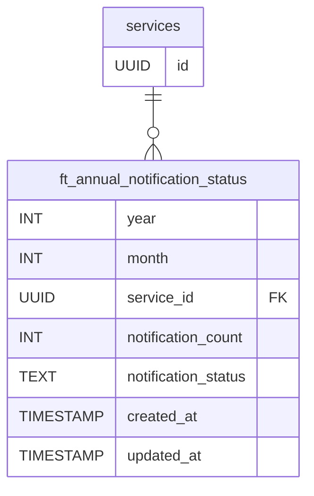

# Annual Limits

Date: 2024-10-03

## Status

**DRAFT**.

## Related ADRs

_TODO: Related ADRs that this ADR is built upon or that this one extends._

## Context

Currently GCNotify does not enforce annual limits for services. This is in part due to the absence of tools and information that services need to easily keep track of their annual limit. Users cannot see their annual limits or their current usage in an annual context. To calculate their usage, users have to manually sum up month over month statistics, creating a barrier that disincentivizes users from honouring their annual limit.

This ADR focuses on enforcing annual limits for self-serve users and providing them with the necessary tools to manage their annual usage.
- Make annual limits and current usage status visible to users in the UI.
- Proactively inform users when their usage nears the annual limit.
- Help users plan by showing how many messages they have left to send.
- When users reach their annual limit, prevent message deployment.

## Why this feature is needed
Ongoing and future efforts to scale Notify, increase message limits, and introduce different account types, necessitates improved control over our costs for Notify to remain sustainable. In order to enforce annual limits we need to support our users with the tools and information that they need to make informed and strategic decisions about their sending patterns with ease.

# Implementation overview
## Features
### Surface annual limits and current usage
Add an annual usage tracker to the dashboard for users to easily gauge their current usage at a glance. The usage tracker links to the annual usage page that breaks down fiscal year usage on a monthly basis.

When users send notifications via the UI they see their current usage for the fiscal year, helping them plan how many messages they can send.

### Provide service owners with quarterly annual usage reports
Send quarterly reports by email notifying users of the current usage for each service they are a part of.

### Notify a service when their usage nears `[annual-limit-warning-percentage]`
When a service's usage reaches the `[annual-limit-warning-percentage]` notify the service owner so they can budget their remaining usage. Send one email for SMS and one for email.

### Notify a service when they reach their annual usage
When a service reaches their allotted annual limit, notify the service owner. Send one email for SMS and one for email.

### Prevent message sending when a service reaches their annual limit
When a service reaches their annual limit, present an error message on the "review before sending" page, informing users they have reached their annual limit.

When sending bulk notifications that would put the service over their annual limit, show a warning and allow them to send if they reduce the number of messages in the bulk send so that they do not exceed their annual limit.

When a service has reached their annual limit then functionality on the "ready to send page" is restricted, preventing further sends.

## Technical considerations
### Performance
To maintain our current page load SLO's and ensure that planning around annual limits is not a cumbersome process for users, we should consider the performance cost of fetching and aggregating a service's notification usage for a given fiscal year. In particular we need to evaluate the impact of aggregating the current day's notifications, as this will always be in flux and vary in size per service.

#### Current implementation
For historical fiscal years, data is fetched from the `ft_notification_status` table. Notification counts are aggregated by day in this table and thus should be quite performant. For the current fiscal year, data is fetched from both the `ft_notification_status` and `notifications` tables before finally being aggregated by month and year.

Each time the "messages sent" page is visisted from the dashboard or a fiscal year is selected on that page, a round trip to API and the database occurs to fetch and aggregate notification data for a given fiscal year. There is currently no result caching on this page.

## Benchmarking the current implementation
### Methodology
In three hypothetical scenarios, notifications were bulk inserted into the `notifications` table for the current day and historical data was inserted into the `ft_notification_status` table.

Using a Cypress test the usage overview page was repeatidly loaded 100 times to fetch the current fiscal year's data. The following metrics were gathered:
- The total load time of the page itself.
- The query fetching current day's notifications from the `notifications` table.
- The query fetching historical notification counts from the `fact_notification_status` table.

The tests were conducted on a local setup, these results serve to provide a rough baseline of performance.

### Scenarios
---
###  1 million daily
In this scenario, we assume that Notify has scaled significantly, and inserted 1 million notifications into the `notifications` table for the current day. Multiples rows were inserted into `ft_notification_status` for each day of the year.


At this volume, the page load times breach our 3 second load time SLO and come close to breaching it numerous other times. Unsurprisingly, the primary culprit is the query to fetch the current day's notifications.

### 500k daily
Still pushing the envelope, in this scenario we insert 500k notifications into the `notifications` table for the current day.

At 500k notificaitons performance is much more reasonable. Page load times are well within the 3 second SLO with the longest loading time peaking at 1.3 seconds.


### 28k daily
Lastly and more realistically, this scenarios measures performance using the average email and sms daily limits of services cuurently in production, excluding `trial` and `restricted` services:
- `26,880 avg email limit + 1,223 avg SMS limit = 28,103 daily notifications`

The difference in performance between 500k and 28k is less drastic than between 1 million and 500k. This points to front end asset loading, scripting, and the API endpoint itself as areas that could be investigated to yield performance improvements.


### Conclusion
The current implementation is performant without load up to ~500k notifications sent by a single service in a day. If we consider system and infrastructure load this estimation may be +/- 100k.

Primarily, performance is bottlenecked on the query fetching the current day's notifications. Since the data has not been aggregated and stored in the fact table yet, there are significantly more rows to be processed when aggregating these notifications monthly. In it's current state, when daily send volumes increase so will the load times for the annual limits page.

Secondarily, front end scripting and asset loading is another area of investigation, any performance gains here would benefit the site overall and not be limited to just the annual limits overview page.

# Implementation

## Addressing Annual Overview page performance

To improve performance when fetching the current day's notifications we could take two main approaches either caching the results in Redis or creating a new fact table to aggregate

## Option 1 - Partial caching in Redis
When a user visits the annual usage overview page the default fiscal year selected is the current fiscal year. Once fetched the data is stored in Redis along with the timestamp of the fetch. On subsequent loads, the timestamp is passed to API and used in the query fetching the current day's notifications. `... where created_at > [last-fetch-timestamp]`



### Pros
- Relatively straightforward
- Good candidate option for a MVP

### Cons
- Increased reliance on Redis, should any issues occur with Redis then performance for the annual limit overview page suffers.
- No single source of truth for annual limit data

## Option 2 - Fact table approach
A new table, `ft_annual_notification_status` is created that stores notification counts aggregated by month for a service.



From a data perspective this means that, for a given year, each service will have two rows per month in the table - one counting successful deliveries, and another counting failures:

| year | month | service_id     | notification_count | notification_status |...|
|------|-------|----------------|--------------------|---------------------|---|
| 2024 |   1   |522b6657-5ca5...| 608                | Delivered           |...|
| 2024 |   1   |522b6657-5ca5...| 27                 | failed              |...|
| 2024 |   2   |522b6657-5ca5...| 608                | Delivered           |...|
| 2024 |   2   |522b6657-5ca5...| 27                 | failed              |...|

### Incrementing counts on the fly
For service owners to accurately manage their annual limits the annual usage data needs to be as close to realtime as possible, hence we cannot rely entirely on nightly celery tasks to update the data in this table like we do for `ft_notification_status`.

#### Option 1 - Update triggered on AWS receipt
When a user sends a notification, and once Notify receives the delivery receipt from AWS, we update the appropriate row in the fact table depending on the `service_id` and `notification_status`.

Ideally this process should be batched in a relatively short timespan to balance between  repeated writes to the DB and timeliness of updating notification counts.

#### Option 2 - Nightly task + manual trigger
Instead of updating the fact table the moment a receipt is received from AWS, the data is updated both via a nightly task and incrementally while a user is on page that displays their current annual usage.

 ```mermaid
flowchart TD
    A(Task is triggered)
    B(Fetch last updated_at from ft_annual_notification_status)
    C(Fetch notifications where created_at >= updated_at)
    D(Aggregate failed and delivered counts)
    E(Increment monthly count in ft_annual_notification_status)

    subgraph Nightly task
        A --> B
        B --> C
        C --> D
        D --> E
    end

    1(Page is loaded)
    2(Fetch notifications where created_at >= updated_at)
    3{has results?}
        3a(Aggregate failed and delivered counts, update month row)
        3b(Set updated_at to the last created)
        3c(Update counts in UI)

    4{interval elapsed?}
        4a(yes)
        4b(no)

    subgraph Polling on Page with limits
        1 --> 2
        2 --> 3
        3 -- yes --> 3a
            3a --> 3b
            3b --> 3c
            3c --> 4
        3 -- no --> 4
        4 -- no --> 2

    end

 ```


## Additional considerations

_TODO: Describe extras in here._

## Decision

_TODO: Describe the way forward._

## Consequences

_TODO: Describe foreseen and felt consequences of the decision (possible after 1-3 months)._
