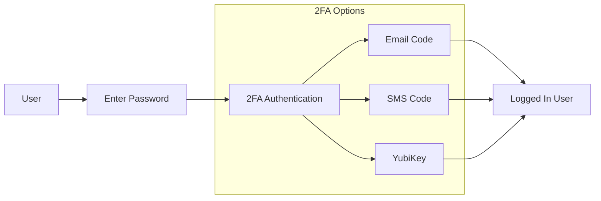

# Different Authentication Methods for Notify

Date: 2025-02-19

## Status

**DRAFT**.

## Context
Two-factor authentication (2FA) provides an additional layer of security beyond passwords by requiring a second verification method. This ADR evaluates Notify's current 2FA methods and the future state for 2FA within our system.

## Problem
Notify currently has three authentication methods:  
1. Email  
1. SMS  
1. FIDO2 supported devices (such as YubiKey)

A client reached out to our support team indicating that their department was going to sunset giving each employee a phone. Employees would be expected to use MS Team phone numbers as the default method for cellular contact. Both the client and the Notify team tested sending an SMS to an MS team number and were unable to do so. Using MS Team numbers for 2FA is not an option.

Given the state of Notify's authentication and sign-up flow, this ADR aims to discuss the different auth types for Notify and decide what our auth flow should be.

Discussions about changes to the sign-up flow will follow the acceptance of this ADR.

## Goals
The goal of this ADR is to identify which authentication methods we should keep using/ if we should implement new ones. 

## Analysis of current auth types
| auth_type  | count |
| ---------- | ----- |
| email_auth | 3,413 |
| sms_auth   | 3,100 |

Even though GC Notify supports other auth types - yubi key for example, we don't store this in the user profile. This is something that we should fix going forward.

| Current Methods | Pros                                                                                                                                                                                                                                          | Cons                                                                                                                                                                                        |
| --------------- | --------------------------------------------------------------------------------------------------------------------------------------------------------------------------------------------------------------------------------------------- | ------------------------------------------------------------------------------------------------------------------------------------------------------------------------------------------- |
| Email 2FA       | • Resistant to SIM swapping attacks • Accessible from multiple devices • Free to implement • Can include rich content and instructions                                                                                            | • Depends on email account security • Potential delivery delays • Can be caught in spam filters • Vulnerable to phishing/spoofing • Requires internet connectivity           |
| SMS 2FA         | • Near-instant delivery • Works on any mobile phone • Ease of use • Functions without internet                                                                                                                                    | • Vulnerable to SIM swapping • Costly • International delivery issues • SS7 network vulnerabilities • No persistent storage                                                  |
| YubiKey         | • Highest security level (hardware-based) • Immune to phishing attacks • No batteries required • Extremely durable • Supports multiple protocols (FIDO2, U2F, OTP) • Works offline • No reliance on mobile network or email | • Initial cost ($45-60 per key) • Requires physical possession • Can be lost or damaged • Limited mobile device support • Learning curve for users • May need backup key  |

Unfortunately, we do not have the data to analyze how many departments provide YubiKeys (if at all) to their users.  
Anecdotally, YubiKeys are not as intuitive to the average user compared to email or SMS.

## Current auth flow

## Security Best Practices

• Hardware security keys (like YubiKey) offer the strongest security   
• Provide backup recovery methods   
• Consider multiple authentication options for user flexibility   
• If choosing between email and SMS, email generally offers better security against targeted attacks    

# Recommendations

The options below are not independent of each other. We can implement multiple options going forward.
My recommendation is to give users options for different 2FA types. This way, users can choose what is convenient
for them while we maintain control over the types of auth flows (for security purposes).

## 1. Remove SMS as a 2FA option  

Currently, Notify requires a user's phone number in the signup flow. 
1. We can remove SMS as an option going forward.  
2. We will need a migration plan to move existing SMS 2FA users to another auth_type.  
3. We would then disable 2FA verification by SMS for all Notify users.  

Benefits of removing SMS-based 2FA:  
• Eliminates vulnerabilities to SIM swapping attacks  
• SMS is known to be the least secure form of 2FA
• Improves overall security posture

## 2. Mobile based Authenticator Apps (TOTP - Time based one time password)
Authenticator apps are widely used by multiple clients and teams for signup flows. Most users will have encountered them while using everyday banking or mail applications.
Authenticators provide one-time passwords generated by applications like Google Authenticator, Microsoft Authenticator, or Authy.
Introducing an authenticator application will not solve the issue of users who do not have a cell phone provided by their department.
This is just an additional 2FA method for clients with a department-provided cellphone.

### Benefits:  
• Works offline once configured  
• Not vulnerable to SIM swapping  
• No SMS costs  
• Higher security than SMS  

### Cons:  
• Requires smartphone and app installation  
• Device loss can lead to account recovery challenges  
• Slightly higher friction during initial setup  

### Implementation:    
The FIDO2 library that Notify currently uses for implementing YubiKey can be extended to include Authenticator apps.
The implementation would follow the details for YubiKey and store login events in the sessions table.

## 3. [Magic Link ADR](https://github.com/cds-snc/notification-adr/pull/64/files)
We can revive the work done in the above ADR for magic links. There is a stock implementation in Notify, we could use for Magic Links.
Please see the above ADR for introducing magic links into our 2FA flow

## 4. Default to using email for 2FA
If we remove SMS as a 2FA method, we should default the 2FA to email authentication.  
• Requires minimal changes to authentication framework as this is already implemented  
• Verification logic remains largely unchanged from SMS implementation  

# Decision

We are not going to offer SMS 2FA auth going forward. There are two reasons for this:  
1. SMS 2FA is not secure (as shown in recommendation 1)
2. Clients without a phone should still be able to sign up for notify

Even though this ADR isn't meant to capture login flow - login flow is crucial to determining how a user sets up their 2FA for the first time.
On the profile page, a user should be able to choose any of the recommended auth options. The design of the page should be such that a user chooses the following 2FA options in order:  
1. YubiKey
2. Authenticator app
3. Magic link
4. Email code auth

Recognizing that the second option is mobile-based(see section below for Desktop based Authenticator apps), we are still going to offer authenticator apps for clients who have smart devices.

**If a client doesn't have a yubi key or a phone, we will default to email_auth for them.**

## Other options that we can revisit in the future

### Passkeys
Many websites are now opting for Passkeys over passwords. Passkeys are bound to specific websites, making them resistant to phishing attacks since they can't be used on fraudulent sites.  
Users don't need to remember, create, or rotate complex passwords. Notify can look into adding passkeys in the future.  

Passkeys will require educating the end user as they do not have wide scale adoption at the moment.
Another disadvantage of passkeys is that they are ideally stored in password managers and many clients do not make use of them.

### Timebased One time Password (TOTP - Desktop Applications)
If we set up authentication for TOTP (as suggested in point 2 above), clients without a phone can choose to use a Desktop-based authenticator application.

The GC Notify team should recommend one of the above apps and also provide instructions on best practices.

#### Desktop TOTP Applications: Pros and Cons

| Pros                                            | Cons                                               |
| ----------------------------------------------- | -------------------------------------------------- |
| Local storage of secrets reduces cloud exposure | Desktop systems more vulnerable to malware         |
| Less dependent on mobile devices                | Potential for system-wide compromise               |
| Backup authentication method                    | Typically lacks biometric protection               |
| More configuration options                      | Security depends on application implementation     |
| Easier management of multiple accounts          | May lack automatic cloud backup                    |
| Convenient for desktop-centric workflows        | Secrets could be exposed during system maintenance |
| Often open-source with community review         | Less portable than mobile solutions                |
| Can integrate with password managers            | Requires the computer to be accessible             |

#### Recommended Implementations

KeePassXC: Open-source password manager with integrated TOTP support  
Authy Desktop: Cross-platform solution with encrypted cloud backup  
2FAS Desktop: Lightweight, security-focused TOTP application  

The GC Notify team should recommend one of the above apps and also provide instructions on best practices.

#### Conclusion
Desktop TOTP applications are an option over mobile-based authenticator apps. They come with their own unique set of challenges that GC Notify would have to provide guidance for.

