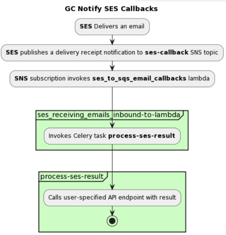
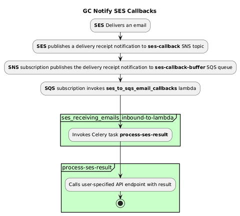

# Batch saved SES receipts

Date: 2025-04-14

## Status

**DRAFT**.

## Related ADRs

N/A

## Context

During tests of the initial batch saving implementation in dev, we discovered that the "list" of receipts received by the ses callback lambda **always** contains a single receipt. This is a blocker to completing the batch saving implementation.

Given we [appeared to be de-batching receipts](https://github.com/cds-snc/notification-lambdas/blob/main/sesemailcallbacks/ses_to_sqs_email_callbacks.py#L17) in our lambda code, the [initial implementation](https://github.com/cds-snc/notification-lambdas/blob/9c7ed0ba304513d9203b5a6af8e02e3cd768c612/sesemailcallbacks/ses_to_sqs_email_callbacks.py#L17) made minor adjustments to the lambda to batch up the receipts instead of sending them off one by one to the `eks-notification-canada-cadelivery-receipts` SQS queue for `process_ses_results` to pick up. Currently E2E testing this code is labourous and deterred validation of this assumption that was proved incorrect during testing.

### The problem
The current infrastructure around receiving and processing ses/pinpoint/sms receipts blocks us from completing the batch saving implementation:
* Subscribers to SNS topics can only pull 1 message from the topic at a time
* There are no options to configure a subscriber to an SNS topic to pull in batches
* SES does not batch receipts it writes to the SNS queue (despite indications that it does as the receipt is stored in `event["Records"]` and is a list)

## Options

There's two main options that we have arrived at to solve this at the **lambda level**:
* Use Redis as a buffer queue to store and flush receipts once a specified `BATCH_SIZE` of receipts have accumulated. Involves both app code and infrastructure changes.
* Add a new SQS queue to buffer receipts. The queue will sit between the SNS topic and the callback lambda. This option is primarily an infrastructure change.

### Option 1 - Introduce a new SQS queue to act as a buffer queue
Unlike SNS, subscribers to SQS queues can be configured to pick up batches of messages at a time from the queue. In the current implementation:

1. SES puts a receipt into an SNS topic
2. The callback lambda, which is subscribed to this topic, pulls 1 receipt event at a time
3. The message is repackaged into a celery task and sent to `process_ses_results` to update the DB, perform API callbacks, etc.

To enable our callback lambda to receive batches of receipts, a new SQS queue is introduced sitting between the SNS topic and lambda, and subscriptions are re-arranged:

1. The lambda subscribes to the new `SQS buffer queue` instead of the SNS topic
2. The `SQS buffer queue` subscribes to the SNS topic

To achieve the desired batching behaviour, the lambda's subscription to the new SQS buffer queue is configured with:
- A [BATCH_SIZE](https://registry.terraform.io/providers/hashicorp/aws/latest/docs/resources/lambda_event_source_mapping#batch_size-1) indicating how many messages to transmit when calling the lambda
- A [`MAX_BATCHING_WINDOW`](https://registry.terraform.io/providers/hashicorp/aws/latest/docs/resources/lambda_event_source_mapping#maximum_batching_window_in_seconds-1) indicating how long to wait between calls to the lambda

The SQS queue continually receives receipt events from the SNS topic and flushes them to the lambda based on the conditions defined by the subscription config:
- The # of messages in queue is >= `BATCH_SIZE`
- The time since the last call to the lambda is >= to the `MAX_BATCHING_WINDOW`
    - Allows us to call the lambda even when the # of messages in the SQS queue is less than the configured `BATCH_SIZE` preventing unnecessary delays.

### Option 2 - Leverage Redis as our buffer queue
Instead of adding a new SQS queue to buffer between the SNS topic and Lambda, Redis is leveraged as the "buffer queue" instead.

1. The lambda remains connected to the SNS topic, and receives receipts 1 by 1 like before
2. Instead of immediately packaging the receipt as a celery task, the lambda adds the receipt to Redis.
3. When the # of receipts in Redis >= to the `BATCH_SIZE` the receipts are flushed from Redis, and sent to `process_ses_results` as a celery task similar to the existing implementation

## Additional considerations

**The added SQS queue approach** makes infrastructure changes to a critical part of the system with the sole purpose being to enable the lambda to receive receipts in batches. However once set up, only minor adjustments to the current implementation are needed to be up and running.

**The latter approach** leaves infrastructure mostly untouched but presents a number of new implementation challenges in enabling Redis functionality in the lambdas:
1. Currently our callback lambdas do not have access to the utils project, which is where our Redis client code lives. Depending on implementation details, this could result in duplicated Redis client code and diverges from our current architecture of keeping the lambdas lightweight and with a specialized purpose.
2. Redis connection secrets need to be added to the lambda's environment variables
3. VPC configuration would need to change to give the lambdas to access the Redis cluster

## Decision

_TODO: Describe the way forward._

## Consequences

_TODO: Describe foreseen and felt consequences of the decision (possible after 1-3 months)._
